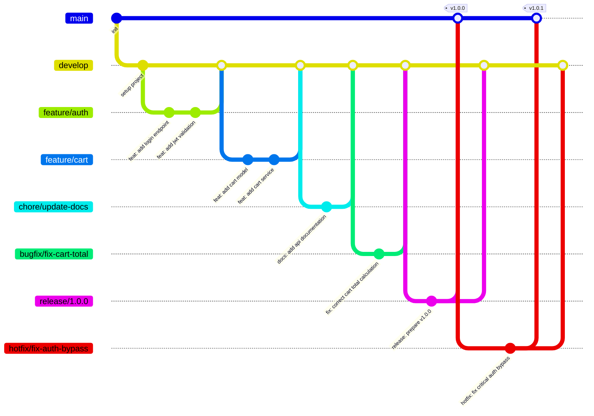
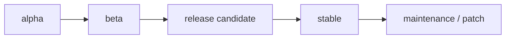

# Guía para Contribuir a TiendaQ

## ¿Quién puede contribuir?

Este proyecto es parte de **K-Forge** en la Fundación Universitaria Konrad Lorenz. Todos los miembros del club pueden contribuir. Si eres externo y deseas colaborar, contacta al equipo a través del repositorio.

---

## Convención para Commits

Para mantener un historial limpio y comprensible, seguimos la convención de **Conventional Commits**.

Formato:

```
type: short message in english
```

> El mensaje siempre debe estar en **inglés**, en **minúsculas** y sin punto final. No usar scopes entre paréntesis.

### Tipos de Commits

| Tipo       | Descripción                                                  |
| ---------- | ------------------------------------------------------------ |
| `feat`     | Nueva funcionalidad                                          |
| `fix`      | Corrección de errores                                        |
| `chore`    | Tareas de mantenimiento del proyecto                         |
| `release`  | Preparación de una nueva versión                             |
| `hotfix`   | Corrección urgente en producción                             |
| `docs`     | Cambios en documentación                                     |
| `refactor` | Refactorización de código sin cambiar comportamiento         |
| `test`     | Agregar o modificar tests                                    |

### Ejemplos Correctos

```
feat: add product listing endpoint
fix: resolve null pointer in cart service
chore: update spring boot dependencies
docs: add database schema documentation
refactor: extract payment logic to service layer
test: add unit tests for user repository
release: prepare version 1.0.0
hotfix: fix critical auth bypass in login
```

### Ejemplos Incorrectos

```
update                          → No describe nada útil
cambios                         → Muy ambiguo y no está en inglés
FEAT: Add product               → No uses mayúsculas
feat(api): add product          → No usar scopes entre paréntesis
feat: Add Product Listing.      → No uses mayúsculas ni punto final
```

---

## Modelo de Ramas — Git Flow

Seguimos el modelo **Git Flow** para organizar el trabajo en ramas. Todas las ramas deben partir de `develop` (excepto `hotfix/*`, que parte de `main`).

### Diagrama de ramas



### Tipos de Ramas

| Rama        | Propósito                                           | Nace de   | Se fusiona en       |
| ----------- | --------------------------------------------------- | --------- | ------------------- |
| `main`      | Código estable en producción                        | —         | —                   |
| `develop`   | Integración de funcionalidades en desarrollo        | `main`    | `release/*`, `main` |
| `feature/*` | Desarrollo de nuevas funcionalidades                | `develop` | `develop`           |
| `chore/*`   | Mantenimiento (docs, configs, dependencias, CI/CD) | `develop` | `develop`           |
| `bugfix/*`  | Corrección de bugs no urgentes en desarrollo        | `develop` | `develop`           |
| `test/*`    | Pruebas de integración o experimentación            | `develop` | `develop`           |
| `hotfix/*`  | Correcciones urgentes en producción                 | `main`    | `main`, `develop`   |
| `release/*` | Preparación de una versión para producción          | `develop` | `main`, `develop`   |

### Cómo crear ramas

```bash
# Desde develop, crear una feature
git checkout develop
git pull origin develop
git checkout -b feature/product-crud

# Mantenimiento (docs, configs, refactor de estructura)
git checkout develop
git pull origin develop
git checkout -b chore/update-dependencies

# Corrección de bug no urgente
git checkout develop
git pull origin develop
git checkout -b bugfix/fix-cart-total

# Desde develop, crear una rama de test
git checkout develop
git pull origin develop
git checkout -b test/cart-integration

# Desde main, crear un hotfix
git checkout main
git pull origin main
git checkout -b hotfix/fix-auth-bypass

# Desde develop, crear un release
git checkout develop
git pull origin develop
git checkout -b release/1.0.0
```

### Convención de nombres para ramas

Usar **kebab-case** (minúsculas separadas por guiones) después del prefijo. Ser descriptivo pero conciso.

```
feature/user-authentication         (correcto)
feature/cart-checkout-flow          (correcto)
chore/update-spring-dependencies    (correcto)
bugfix/fix-cart-total-calculation   (correcto)
hotfix/fix-payment-timeout          (correcto)
release/1.2.0                       (correcto)
test/order-e2e                      (correcto)

feature/MiFeature                   (incorrecto — no usar camelCase)
Feature/nueva-feature               (incorrecto — prefijo en mayúscula)
fix-bug                             (incorrecto — falta prefijo)
feature/x                           (incorrecto — no es descriptivo)
```

### Flujo completo de trabajo — Ejemplo

```bash
# 1. Actualizar develop
git checkout develop
git pull origin develop

# 2. Crear feature
git checkout -b feature/order-history

# 3. Trabajar y hacer commits
git add .
git commit -m "feat: add order history endpoint"

git add .
git commit -m "feat: add order history page"

# 4. Push de la rama
git push origin feature/order-history

# 5. Crear Pull Request → develop
# Esperar code review y aprobación

# 6. Merge a develop (vía PR)
# 7. Eliminar la rama feature
git branch -d feature/order-history
```

---

## Versionamiento

Seguimos **SemVer** (Semantic Versioning) con formato `MAJOR.MINOR.PATCH`.

| Segmento | Cuándo incrementar                                | Ejemplo            |
| -------- | ------------------------------------------------- | ------------------ |
| `MAJOR`  | Cambios incompatibles con versiones anteriores    | `1.0.0` → `2.0.0`  |
| `MINOR`  | Nueva funcionalidad compatible hacia atrás        | `1.0.0` → `1.1.0`  |
| `PATCH`  | Correcciones de errores en producción (hotfix)    | `1.1.0` → `1.1.1`  |

### Versiones Pre-release

Para versiones en desarrollo o pruebas, se agrega un sufijo:

```
1.0.0-alpha.1    → Primera iteración en desarrollo, puede ser inestable
1.0.0-alpha.2    → Segunda iteración en desarrollo
1.0.0-beta.1     → Primera versión en pruebas, funcionalidad completa
1.0.0-beta.2     → Segunda versión en pruebas
1.0.0            → Versión estable lista para producción
```

### Ciclo de vida de una versión



1. **Alpha** — Funcionalidad en desarrollo, puede ser inestable
2. **Beta** — Funcionalidad completa, en fase de pruebas
3. **Release Candidate** — Candidata a versión estable
4. **Stable** — Versión lista para producción
5. **Maintenance** — Correcciones post-release (patches)

```bash
# 1. Crear rama de release desde develop
git checkout develop
git pull origin develop
git checkout -b release/1.0.0-alpha

# 2. Commit de preparación
git commit -m "release: prepare v1.0.0-alpha"

# 3. Mergear a main y taggear
git checkout main
git merge release/1.0.0-alpha
git tag -a v1.0.0-alpha -m "release: v1.0.0-alpha"
git push origin main --tags

# 4. Mergear de vuelta a develop
git checkout develop
git merge release/1.0.0-alpha
```

---

## Estándares de Código

### Backend (Spring Boot)

El backend utiliza **Java 25** y **Spring Boot 4.0**. Seguir las convenciones estándar de Java:

- Nombres de clases en **PascalCase**
- Nombres de métodos y variables en **camelCase**
- Constantes en **UPPER_SNAKE_CASE**
- Paquetes en **minúsculas**
- Indentación con 4 espacios (convención Java estándar)

### Frontend (Angular)

El proyecto frontend utiliza **Prettier** y **EditorConfig** para mantener un estilo consistente. Configuraciones en `app/frontend/`.

#### Prettier

Archivo: `app/frontend/.prettierrc`

```json
{
  "printWidth": 100,
  "singleQuote": true,
  "overrides": [
    {
      "files": "*.html",
      "options": {
        "parser": "angular"
      }
    }
  ]
}
```

Reglas principales:

- Ancho máximo de línea: **100 caracteres**
- Comillas simples (`'`) en lugar de dobles
- Archivos `.html` formateados con el parser de Angular

Para formatear manualmente:

```bash
cd app/frontend
npx prettier --write "src/**/*.{ts,html,scss}"
```

#### EditorConfig

Archivo: `app/frontend/.editorconfig`

| Regla                                | Valor                     |
| ------------------------------------ | ------------------------- |
| Charset                              | `utf-8`                   |
| Indentación                          | Espacios, 2 por nivel     |
| Nueva línea al final del archivo     | Sí                        |
| Eliminar espacios en blanco al final | Sí                        |
| Archivos `.ts`                       | Comillas simples          |
| Archivos `.md`                       | Sin límite de línea       |

La mayoría de editores modernos leen `.editorconfig` automáticamente. En VS Code, instala la extensión [EditorConfig for VS Code](https://marketplace.visualstudio.com/items?itemName=EditorConfig.EditorConfig).

#### Extensiones recomendadas de VS Code

- **Angular Language Service** (`angular.ng-template`)
- **EditorConfig for VS Code** (`editorconfig.editorconfig`)
- **Prettier - Code formatter** (`esbenp.prettier-vscode`)

Activar "Format on Save" en VS Code para mantener el estilo automáticamente.

---

> Si el equipo define hooks de Git para validación automática, instálalos según las instrucciones internas del repositorio antes de abrir un PR.
