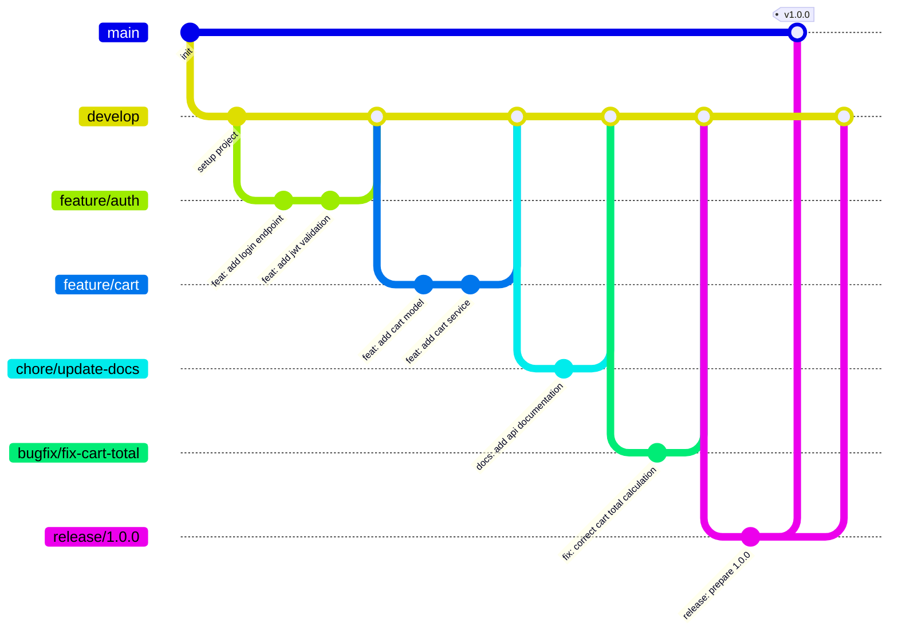
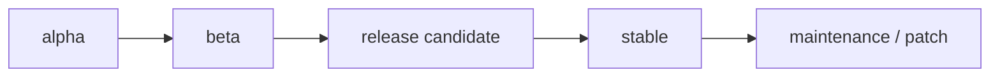

# Guia para Contribuir a TiendaQ

## Quien puede contribuir?

Todos los miembros del club **K-Forge** de la Fundación Universitaria Konrad Lorenz (FUKL) pueden contribuir a este proyecto. Si eres externo y deseas colaborar, contacta al equipo a través del repositorio.

---

## Convencion para Commits

Para mantener un historial limpio y comprensible, seguimos la convención de **Conventional Commits**. Usa el siguiente formato para tus mensajes de commit:

```
type: short message in english
```

> El mensaje siempre debe estar en **inglés**, en **minúsculas**, y sin punto final.

---

### Tipos de Commits

| Tipo       | Descripción                                    |
| ---------- | ---------------------------------------------- |
| `feat`     | Nueva funcionalidad                            |
| `fix`      | Corrección de errores                          |
| `chore`    | Tareas de mantenimiento del proyecto           |
| `release`  | Preparación de una nueva versión               |
| `hotfix`   | Corrección urgente en producción               |
| `docs`     | Cambios en documentación                       |
| `refactor` | Refactorización de código sin cambiar comportamiento |
| `test`     | Agregar o modificar tests                      |

---

### Ejemplos Correctos

```
feat: add product listing endpoint
fix: resolve null pointer in cart service
chore: update spring boot dependencies
docs: add database schema documentation
refactor: extract payment logic to service layer
test: add unit tests for user repository
release: prepare version 1.0.0
hotfix: fix critical auth bypass in login
```

### Ejemplos Incorrectos

```
update                          → No describe nada útil
cambios                         → Muy ambiguo, y no está en inglés
arreglos varios                 → No es claro qué se hizo
FEAT: Add product               → No uses mayúsculas
feat(api): add product          → No uses scopes entre paréntesis
feat: Add Product Listing.      → No uses mayúsculas ni punto final
```

---

## Modelo de Ramas — Git Flow

Seguimos el modelo **Git Flow** para organizar el trabajo en ramas.



---

### Tipos de Ramas

| Rama           | Propósito                                    | Nace de     | Se fusiona en         |
| -------------- | -------------------------------------------- | ----------- | --------------------- |
| `main`         | Código estable en producción                 | —           | —                     |
| `develop`      | Integración de funcionalidades en desarrollo | `main`      | `release/*`, `main`   |
| `feature/*`    | Desarrollo de nuevas funcionalidades         | `develop`   | `develop`             |
| `chore/*`      | Mantenimiento (docs, configs, dependencias, CI/CD) | `develop`   | `develop`             |
| `bugfix/*`     | Corrección de bugs no urgentes en desarrollo | `develop`   | `develop`             |
| `test/*`       | Pruebas de integración o experimentación     | `develop`   | `develop`             |
| `hotfix/*`     | Correcciones urgentes en producción          | `main`      | `main`, `develop`     |
| `release/*`    | Preparación de una versión para producción   | `develop`   | `main`, `develop`     |

---

### Como crear ramas

```bash
# Desde develop, crear una feature
git checkout develop
git pull origin develop
git checkout -b feature/product-crud

# Mantenimiento (docs, configs, refactor de estructura)
git checkout develop
git pull origin develop
git checkout -b chore/update-dependencies

# Corrección de bug no urgente
git checkout develop
git pull origin develop
git checkout -b bugfix/fix-cart-total

# Desde develop, crear una rama de test
git checkout develop
git checkout -b test/cart-integration

# Desde main, crear un hotfix
git checkout main
git pull origin main
git checkout -b hotfix/fix-auth-bypass

# Desde develop, crear un release
git checkout develop
git checkout -b release/1.0.0
```

---

### Convencion de nombres para ramas

- Usar **kebab-case** (minúsculas separadas por guiones)
- Ser descriptivo pero conciso
- Siempre usar el prefijo correspondiente

```
feature/user-authentication          (correcto)
feature/cart-checkout-flow           (correcto)
chore/update-spring-dependencies     (correcto)
chore/add-api-documentation          (correcto)
bugfix/fix-cart-total-calculation    (correcto)
bugfix/fix-null-pointer-product      (correcto)
hotfix/fix-payment-timeout           (correcto)
release/1.2.0                        (correcto)
test/order-e2e                       (correcto)

feature/MiFeature                    (incorrecto)
Feature/nueva-feature                (incorrecto)
fix-bug                              (incorrecto — falta prefijo hotfix/ o feature/)
feature/x                            (incorrecto — no es descriptivo)
```

---

### Flujo completo de trabajo — Ejemplo

```bash
# 1. Actualizar develop
git checkout develop
git pull origin develop

# 2. Crear feature
git checkout -b feature/order-history

# 3. Trabajar y hacer commits
git add .
git commit -m "feat: add order history endpoint"

git add .
git commit -m "feat: add order history page"

# 4. Push de la rama
git push origin feature/order-history

# 5. Crear Pull Request → develop
# Esperar code review y aprobación

# 6. Merge a develop (vía PR)
# 7. Eliminar la rama feature
git branch -d feature/order-history
```

---

## Versionamiento

Seguimos un esquema inspirado en **SemVer** (Semantic Versioning):

```
MAJOR.MINOR.PATCH
```

| Segmento | Cuándo incrementar                                         | Ejemplo          |
| -------- | ---------------------------------------------------------- | ---------------- |
| `MAJOR`  | Cambios incompatibles con versiones anteriores (breaking)  | `1.0.0` → `2.0.0` |
| `MINOR`  | Nueva funcionalidad compatible hacia atrás                 | `1.0.0` → `1.1.0` |
| `PATCH`  | Correcciones de errores o mejoras menores                  | `1.0.0` → `1.0.1` |

---

### Versiones Pre-release

Para versiones en desarrollo o pruebas, se agrega un sufijo:

```
1.0.0-alpha.1    → Primera iteración en desarrollo
1.0.0-alpha.2    → Segunda iteración en desarrollo
1.0.0-beta.1     → Primera versión en pruebas
1.0.0-beta.2     → Segunda versión en pruebas
1.0.0            → Versión estable
```

---

### Ciclo de vida de una version



1. **Alpha** — Funcionalidad en desarrollo, puede ser inestable
2. **Beta** — Funcionalidad completa, en fase de pruebas
3. **Release Candidate** — Candidata a versión estable
4. **Stable** — Versión lista para producción
5. **Maintenance** — Correcciones post-release (patches)

---

## Estandares de Codigo

### Frontend (Angular)

El proyecto frontend utiliza **Prettier** y **EditorConfig** para mantener un estilo de codigo consistente. Las configuraciones se encuentran en `app/frontend/`.

#### Prettier

Archivo: `app/frontend/.prettierrc`

```json
{
  "printWidth": 100,
  "singleQuote": true,
  "overrides": [
    {
      "files": "*.html",
      "options": {
        "parser": "angular"
      }
    }
  ]
}
```

Reglas principales:

- Ancho maximo de linea: **100 caracteres**
- Comillas simples (`'`) en lugar de dobles
- Archivos `.html` se formatean con el parser de Angular

Prettier esta instalado como dependencia de desarrollo (`prettier: ^3.8.1` en `app/frontend/package.json`). Para formatear el codigo manualmente:

```bash
cd app/frontend
npx prettier --write "src/**/*.{ts,html,scss}"
```

#### EditorConfig

Archivo: `app/frontend/.editorconfig`

| Regla | Valor |
| --- | --- |
| Charset | `utf-8` |
| Indentacion | Espacios, 2 por nivel |
| Nueva linea al final del archivo | Si |
| Eliminar espacios en blanco al final | Si |
| Archivos `.ts` | Comillas simples |
| Archivos `.md` | Sin limite de linea, no recortar espacios |

La mayoria de editores modernos leen `.editorconfig` automaticamente. En VS Code, instala la extension [EditorConfig for VS Code](https://marketplace.visualstudio.com/items?itemName=EditorConfig.EditorConfig).

#### Extensiones de VS Code recomendadas

El proyecto incluye extensiones recomendadas en `app/frontend/.vscode/extensions.json`. Para el desarrollo frontend, se recomienda ademas:

- **Angular Language Service** (`angular.ng-template`) — incluida en el proyecto
- **EditorConfig for VS Code** (`editorconfig.editorconfig`)
- **Prettier - Code formatter** (`esbenp.prettier-vscode`)

Configura Prettier como formateador por defecto en VS Code y activa "Format on Save" para mantener el estilo automaticamente.

### Backend (Spring Boot)

El backend esta construido con **Spring Boot 4.0** y **Maven**. Actualmente no hay un checkstyle ni formateador configurado de forma explicita. Se recomienda seguir las convenciones estandar de Java:

- Nombres de clases en **PascalCase**
- Nombres de metodos y variables en **camelCase**
- Constantes en **UPPER_SNAKE_CASE**
- Paquetes en **minusculas**
- Indentacion con 4 espacios (convencion Java estandar)

---

<!-- Los scripts de instalación de hooks de Git Glow se encuentran en la carpeta scripts/ y están diferenciados por plataforma: macos-git-glow.sh y windows-git-glow.ps1. -->
