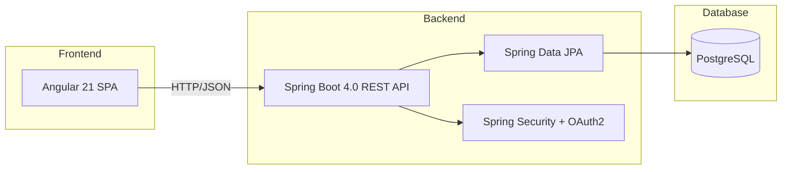

# TiendaQ

Sistema de comercio electronico desarrollado para la **Fundacion Universitaria Konrad Lorenz (FUKL)** por el club de desarrollo de software **K-Forge**. Permite a clientes navegar un catalogo, gestionar carritos de compras y realizar compras, y a empleados gestionar productos, inventario y facturacion.

> En desarrollo — Backend API implementado en Spring Boot 4.0. Frontend en fase de scaffold con Angular 21.

---

## Stack tecnologico

| Capa | Tecnologia | Version |
| --- | --- | --- |
| Lenguaje backend | Java | 25 |
| Framework backend | Spring Boot | 4.0.0 |
| Persistencia | Spring Data JPA (Hibernate) | -- |
| Seguridad | Spring Security + OAuth2 Client | -- |
| Validacion | Spring Validation (Jakarta) | -- |
| Utilidades | Lombok | -- |
| Build backend | Maven | 3.9+ |
| Base de datos | PostgreSQL | 15+ |
| Framework frontend | Angular | 21.2.0 |
| CLI frontend | Angular CLI | 21.2.2 |
| Routing | Angular Router | -- |
| HTTP Client | Angular HttpClient | -- |
| Estilos | SCSS | -- |
| Package manager | Bun | -- |

## Arquitectura



El backend implementa una arquitectura en capas (Controller, Service, Repository, Model) siguiendo el patron estandar de Spring Boot. Incluye 6 enums, 8 entidades JPA, 8 repositorios, 8 servicios y 8 controladores REST.

## Estructura del proyecto

```
TiendaQ/
├── .agent/
│   └── skills/               # Skills y configuracion para agentes de IA
├── .gitignore
├── app/
│   ├── backend/
│   │   ├── postman/          # Scripts de prueba para la API
│   │   └── tiendaq/          # API Spring Boot 4.0
│   ├── database/
│   │   ├── SCRIPTS_POSTGRES.sql
│   │   ├── SCRIPTS_MYSQL_LEGACY.sql
│   │   ├── INSERTS.sql
│   │   └── DELETE.sql
│   └── frontend/             # Angular 21
├── docs/
│   ├── REQUIREMENTS.md
│   ├── DESIGN.md
│   ├── PROGRESS.md
│   └── DATABASE.md
├── scripts/
│   ├── start-back.sh
│   └── start-front.sh
├── AGENT.md
├── CODE_OF_CONDUCT.md
├── CONTRIBUTING.md
├── LICENSE
├── package.json
├── README.md
└── SECURITY.md
```

## Inicio rapido

### Requisitos previos

- Java 25+
- Maven 3.9+
- PostgreSQL 15+
- Bun (o Node.js 20+)

### Base de datos

```bash
# Crear la base de datos PostgreSQL
psql -U postgres -c "CREATE DATABASE \"tiendaq\";"

# Ejecutar el esquema
psql -U postgres -d "tiendaq" -f app/database/SCRIPTS_POSTGRES.sql

# Insertar datos de prueba
psql -U postgres -d "tiendaq" -f app/database/INSERTS.sql
```

### Backend (Spring Boot)

```bash
# Opcion 1: Script
./scripts/start-back.sh

# Opcion 2: Manual
cd app/backend/tiendaq
./mvnw spring-boot:run
```

> El servidor inicia en `http://localhost:8080`

### Frontend (Angular)

```bash
# Opcion 1: Script
./scripts/start-front.sh

# Opcion 2: Manual
cd app/frontend
bun install
bun start
```

> La aplicacion inicia en `http://localhost:4200`

## Endpoints de la API

8 controladores REST con 33 endpoints implementados. Todos bajo el prefijo `/api/`.

### Productos — `/api/productos`

| Metodo | Endpoint | Descripcion |
| --- | --- | --- |
| `GET` | `/api/productos` | Listar todos los productos |
| `GET` | `/api/productos/{id}` | Obtener producto por ID |
| `GET` | `/api/productos/categoria/{categoria}` | Filtrar productos por categoria |
| `POST` | `/api/productos` | Crear un producto |
| `PUT` | `/api/productos/{id}` | Actualizar un producto |
| `DELETE` | `/api/productos/{id}` | Eliminar un producto |

### Usuarios — `/api/usuarios`

| Metodo | Endpoint | Descripcion |
| --- | --- | --- |
| `GET` | `/api/usuarios` | Listar todos los usuarios |
| `GET` | `/api/usuarios/{id}` | Obtener usuario por ID |
| `POST` | `/api/usuarios` | Crear un usuario |
| `PUT` | `/api/usuarios/{id}` | Actualizar un usuario |
| `DELETE` | `/api/usuarios/{id}` | Eliminar un usuario |

### Clientes — `/api/clientes`

| Metodo | Endpoint | Descripcion |
| --- | --- | --- |
| `GET` | `/api/clientes/{idUsuario}` | Obtener cliente por ID de usuario |
| `POST` | `/api/clientes` | Crear un cliente |
| `PUT` | `/api/clientes/{idUsuario}` | Actualizar un cliente |

### Empleados — `/api/empleados`

| Metodo | Endpoint | Descripcion |
| --- | --- | --- |
| `GET` | `/api/empleados/{id}` | Obtener empleado por ID |
| `GET` | `/api/empleados/usuario/{idUsuario}` | Obtener empleado por ID de usuario |

### Carritos — `/api/carritos`

| Metodo | Endpoint | Descripcion |
| --- | --- | --- |
| `GET` | `/api/carritos/usuario/{idUsuario}` | Listar carritos por usuario |
| `GET` | `/api/carritos/{id}` | Obtener carrito por ID |
| `POST` | `/api/carritos` | Crear un carrito |
| `PUT` | `/api/carritos/{id}` | Actualizar un carrito |
| `DELETE` | `/api/carritos/{id}` | Eliminar un carrito |

### Items del carrito — `/api/items`

| Metodo | Endpoint | Descripcion |
| --- | --- | --- |
| `GET` | `/api/items/carrito/{idCarrito}` | Listar items por carrito |
| `POST` | `/api/items` | Crear un item |
| `PUT` | `/api/items` | Actualizar un item |
| `DELETE` | `/api/items/{idCarrito}/{idProducto}` | Eliminar un item |

### Facturas — `/api/facturas`

| Metodo | Endpoint | Descripcion |
| --- | --- | --- |
| `GET` | `/api/facturas/cliente/{idCliente}` | Listar facturas por cliente |
| `GET` | `/api/facturas/{id}` | Obtener factura por ID |
| `POST` | `/api/facturas` | Crear una factura |

### Stock — `/api/stock`

| Metodo | Endpoint | Descripcion |
| --- | --- | --- |
| `GET` | `/api/stock/producto/{idProducto}` | Listar stock por producto |
| `GET` | `/api/stock/{id}` | Obtener registro de stock por ID |
| `POST` | `/api/stock` | Crear un registro de stock |
| `PUT` | `/api/stock/{id}` | Actualizar registro de stock |
| `DELETE` | `/api/stock/{id}` | Eliminar registro de stock |

## Documentacion

| Documento | Descripcion |
| --- | --- |
| [README.md](README.md) | Guia general del proyecto |
| [REQUIREMENTS.md](docs/REQUIREMENTS.md) | Especificacion de Requisitos de Software (SRS) |
| [DESIGN.md](docs/DESIGN.md) | Documento de Diseno de Software (SDD) |
| [PROGRESS.md](docs/PROGRESS.md) | Estado actual de implementacion |
| [DATABASE.md](docs/DATABASE.md) | Documentacion del esquema de base de datos |
| [CONTRIBUTING.md](CONTRIBUTING.md) | Guia de contribucion y flujo Git |
| [CODE_OF_CONDUCT.md](CODE_OF_CONDUCT.md) | Codigo de conducta de la comunidad |
| [SECURITY.md](SECURITY.md) | Politica de reporte de vulnerabilidades |
| [LICENSE](LICENSE) | Licencia del proyecto (propietaria, K-Forge) |
| [AGENT.md](AGENT.md) | Contexto para asistentes de IA |

## Equipo

Desarrollado por **K-Forge** — Club de desarrollo de software de la Fundacion Universitaria Konrad Lorenz.

| Miembro | GitHub |
| --- | --- |
| Brian Vargas | [@13rianVargas](https://github.com/13rianVargas) |
| Alejandra Duran | [@Alejandra Duran](https://github.com/Alejandra-Duran) |
| Alejandraqt | [@Alejandraqt](https://github.com/Alejandraqt) |
| Camilo Prieto | [@Camilo Prieto](https://github.com/Camilo-Prieto) |
| KamiroDark | [@KamiroDark](https://github.com/KamiroDark) |
| Mike | [@Mike](https://github.com/Mike) |

## Licencia

Ver [LICENSE](LICENSE)
