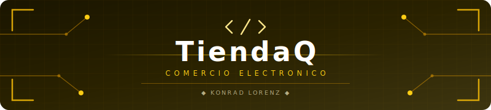
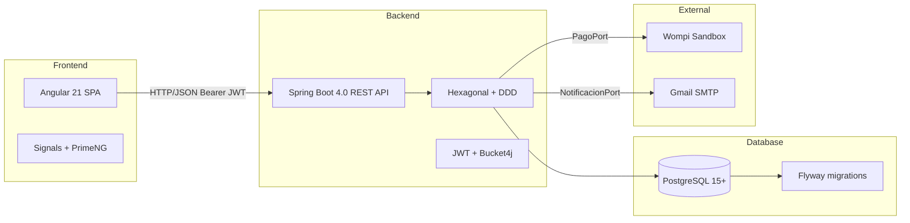

<a id="top"></a>

<div align="center">
  <table style="border: none; background-color: transparent;">
    <tr style="border: none; background-color: transparent;">
      <td align="center" width="20%" style="border: none;">
        <!-- ESPACIO RESERVADO PARA LOGO OFICIAL K-FORGE -->
        
      </td>
      <td align="center" width="80%" style="border: none;">
        <!-- BANNER CIBERNETICO DEL PROYECTO -->
        
      </td>
    </tr>
  </table>
</div>

<p align="center"><strong>Sistema de comercio electronico de la Fundacion Universitaria Konrad Lorenz.</strong></p>

<p align="center">
  
  
  
  
  
</p>

---

## Tabla de Contenidos

- [Descripcion](#descripcion)
- [Stack tecnologico](#stack-tecnologico)
- [Arquitectura](#arquitectura)
- [Inicio rapido](#inicio-rapido)
- [Endpoints de la API](#endpoints-de-la-api)
- [Documentacion](#documentacion)
- [Enlaces rapidos](#enlaces-rapidos)
- [Equipo](#equipo)
- [Licencia](#licencia)

---

## Descripcion

TiendaQ es el sistema de comercio electronico de la Fundacion Universitaria Konrad Lorenz, desarrollado por K-Forge para gestionar catalogo, carrito, compras, inventario y facturacion en un flujo unificado.

> En desarrollo — Backend API implementado en Spring Boot 4.0. Frontend en fase de scaffold con Angular 21.

## Stack tecnologico

| Capa               | Tecnologia                          | Version |
| ------------------ | ----------------------------------- | ------- |
| Lenguaje backend   | Java                                | 25      |
| Framework backend  | Spring Boot                         | 4.0.0   |
| Persistencia       | Spring Data JPA (Hibernate)         | --      |
| Seguridad          | Spring Security + OAuth2 Client     | --      |
| Validacion         | Spring Validation (Jakarta)         | --      |
| Utilidades         | Lombok                              | --      |
| Build backend      | Maven                               | 3.9+    |
| Base de datos      | PostgreSQL                          | 15+     |
| Framework frontend | Angular                             | 21.2.0  |
| CLI frontend       | Angular CLI                         | 21.2.2  |
| Routing            | Angular Router                      | --      |
| HTTP Client        | Angular HttpClient                  | --      |
| Estilos            | SCSS                                | --      |
| Package manager    | pnpm (dependencias) + Bun (scripts) | --      |

## Arquitectura



Backend en **Arquitectura Hexagonal + DDD** con 7 bounded contexts: Identidad, Catalogo, Inventario, Carrito, Pedidos, Pagos, Reportes. Cada contexto tiene capas `domain/`, `application/`, `infrastructure/`. El dominio no depende de Spring ni JPA.

## Estructura del proyecto

```
TiendaQ/
├── app/
│   ├── backend/
│   │   ├── postman/          # Scripts de prueba para la API
│   │   └── tiendaq/          # API Spring Boot 4.0
│   ├── database/
│   │   ├── SCRIPTS_POSTGRES.sql
│   │   ├── SCRIPTS_MYSQL_LEGACY.sql
│   │   ├── INSERTS.sql
│   │   └── DELETE.sql
│   └── frontend/             # Angular 21
├── docs/
│   ├── REQUIREMENTS.md
│   ├── DESIGN.md
│   ├── PROGRESS.md
│   └── DATABASE.md
├── scripts/
│   ├── start-back.sh
│   └── start-front.sh
├── AGENTS.md
├── CONTRIBUTING.md
├── LICENSE
├── package.json
└── README.md
```

## Inicio rapido

### Requisitos previos

- Java 25+
- Maven 3.9+
- PostgreSQL 15+
- Bun + pnpm

### Setup de herramientas (una sola vez)

```bash
corepack enable && corepack prepare pnpm@latest --activate
curl -fsSL https://bun.sh/install | bash
```

### Base de datos

```bash
# Crear la base de datos PostgreSQL
psql -U postgres -c "CREATE DATABASE \"tiendaq\";"

# Ejecutar el esquema
psql -U postgres -d "tiendaq" -f app/database/SCRIPTS_POSTGRES.sql

# Insertar datos de prueba
psql -U postgres -d "tiendaq" -f app/database/INSERTS.sql
```

### Backend (Spring Boot)

```bash
# Opcion 1: Script
./scripts/start-back.sh

# Opcion 2: Manual
cd app/backend/tiendaq
./mvnw spring-boot:run
```

> El servidor inicia en `http://localhost:8080`

### Frontend (Angular)

```bash
# Opcion 1: Script
./scripts/start-front.sh

# Opcion 2: Manual
cd app/frontend
pnpm install
bun start
```

> La aplicacion inicia en `http://localhost:4200`

## Endpoints de la API

8 controladores REST con 33 endpoints implementados. Todos bajo el prefijo `/api/`.

### Productos — `/api/productos`

| Metodo   | Endpoint                               | Descripcion                     |
| -------- | -------------------------------------- | ------------------------------- |
| `GET`    | `/api/productos`                       | Listar todos los productos      |
| `GET`    | `/api/productos/{id}`                  | Obtener producto por ID         |
| `GET`    | `/api/productos/categoria/{categoria}` | Filtrar productos por categoria |
| `POST`   | `/api/productos`                       | Crear un producto               |
| `PUT`    | `/api/productos/{id}`                  | Actualizar un producto          |
| `DELETE` | `/api/productos/{id}`                  | Eliminar un producto            |

### Usuarios — `/api/usuarios`

| Metodo   | Endpoint             | Descripcion               |
| -------- | -------------------- | ------------------------- |
| `GET`    | `/api/usuarios`      | Listar todos los usuarios |
| `GET`    | `/api/usuarios/{id}` | Obtener usuario por ID    |
| `POST`   | `/api/usuarios`      | Crear un usuario          |
| `PUT`    | `/api/usuarios/{id}` | Actualizar un usuario     |
| `DELETE` | `/api/usuarios/{id}` | Eliminar un usuario       |

### Clientes — `/api/clientes`

| Metodo | Endpoint                    | Descripcion                       |
| ------ | --------------------------- | --------------------------------- |
| `GET`  | `/api/clientes/{idUsuario}` | Obtener cliente por ID de usuario |
| `POST` | `/api/clientes`             | Crear un cliente                  |
| `PUT`  | `/api/clientes/{idUsuario}` | Actualizar un cliente             |

### Empleados — `/api/empleados`

| Metodo | Endpoint                             | Descripcion                        |
| ------ | ------------------------------------ | ---------------------------------- |
| `GET`  | `/api/empleados/{id}`                | Obtener empleado por ID            |
| `GET`  | `/api/empleados/usuario/{idUsuario}` | Obtener empleado por ID de usuario |

### Carritos — `/api/carritos`

| Metodo   | Endpoint                            | Descripcion                 |
| -------- | ----------------------------------- | --------------------------- |
| `GET`    | `/api/carritos/usuario/{idUsuario}` | Listar carritos por usuario |
| `GET`    | `/api/carritos/{id}`                | Obtener carrito por ID      |
| `POST`   | `/api/carritos`                     | Crear un carrito            |
| `PUT`    | `/api/carritos/{id}`                | Actualizar un carrito       |
| `DELETE` | `/api/carritos/{id}`                | Eliminar un carrito         |

### Items del carrito — `/api/items`

| Metodo   | Endpoint                              | Descripcion              |
| -------- | ------------------------------------- | ------------------------ |
| `GET`    | `/api/items/carrito/{idCarrito}`      | Listar items por carrito |
| `POST`   | `/api/items`                          | Crear un item            |
| `PUT`    | `/api/items`                          | Actualizar un item       |
| `DELETE` | `/api/items/{idCarrito}/{idProducto}` | Eliminar un item         |

### Facturas — `/api/facturas`

| Metodo | Endpoint                            | Descripcion                 |
| ------ | ----------------------------------- | --------------------------- |
| `GET`  | `/api/facturas/cliente/{idCliente}` | Listar facturas por cliente |
| `GET`  | `/api/facturas/{id}`                | Obtener factura por ID      |
| `POST` | `/api/facturas`                     | Crear una factura           |

### Stock — `/api/stock`

| Metodo   | Endpoint                           | Descripcion                      |
| -------- | ---------------------------------- | -------------------------------- |
| `GET`    | `/api/stock/producto/{idProducto}` | Listar stock por producto        |
| `GET`    | `/api/stock/{id}`                  | Obtener registro de stock por ID |
| `POST`   | `/api/stock`                       | Crear un registro de stock       |
| `PUT`    | `/api/stock/{id}`                  | Actualizar registro de stock     |
| `DELETE` | `/api/stock/{id}`                  | Eliminar registro de stock       |

## Documentacion

| Documento | Descripcion |
|-----------|-------------|
| [docs/README.md](docs/README.md) | Indice de navegacion de toda la documentacion tecnica |
| [docs/DOMAIN.md](docs/DOMAIN.md) | Glosario ubicuo, bounded contexts, context map |
| [docs/REQUIREMENTS.md](docs/REQUIREMENTS.md) | SRS v3.0 — actores, FR/NFR, casos de uso, trazabilidad |
| [docs/DESIGN.md](docs/DESIGN.md) | SDD — C4, hexagonal, filtros Spring, state machines |
| [docs/DATABASE.md](docs/DATABASE.md) | Esquema, Flyway, BigDecimal, indices, soft-delete |
| [docs/FRONTEND.md](docs/FRONTEND.md) | Angular 21, Signals, PrimeNG, Atomic Design |
| [docs/OPERATIONS.md](docs/OPERATIONS.md) | CI/CD, Docker, runbook, observabilidad |
| [docs/TESTING.md](docs/TESTING.md) | Piramide de testing, Testcontainers, Playwright |
| [docs/PROGRESS.md](docs/PROGRESS.md) | Estado actual de implementacion |
| [docs/api/openapi.yaml](docs/api/openapi.yaml) | Contrato REST (source of truth) |
| [AGENTS.md](AGENTS.md) | Contexto para asistentes de IA |
| [CONTRIBUTING.md](CONTRIBUTING.md) | Guia de contribucion y flujo Git |
| [LICENSE](LICENSE) | Licencia del proyecto (propietaria, K-Forge) |

## Enlaces rapidos

| Recurso                  | Enlace                                           |
| ------------------------ | ------------------------------------------------ |
| Organizacion K-Forge     | [github.com/K-Forge](https://github.com/K-Forge) |
| Web oficial K-Forge      | [kforge.vercel.app](https://kforge.vercel.app)   |
| Guia de contribucion     | [CONTRIBUTING.md](CONTRIBUTING.md)               |
| Contribuyentes           | [CONTRIBUTORS.md](CONTRIBUTORS.md)               |
| Diseno y arquitectura    | [docs/DESIGN.md](docs/DESIGN.md)                 |
| Esquema de base de datos | [docs/DATABASE.md](docs/DATABASE.md)             |
| Contacto                 | kforge.dev@gmail.com                             |

## Equipo

Desarrollado por **K-Forge** — Club de desarrollo de software de la Fundacion Universitaria Konrad Lorenz.

- Integrantes y contribuyentes: [CONTRIBUTORS.md](CONTRIBUTORS.md)
- Contacto del equipo: `kforge.dev@gmail.com`

## Licencia

Ver [LICENSE](LICENSE)

---

<div align="center">
  <br>
  <a href="https://github.com/K-Forge">
    
  </a>
  &nbsp;
  <a href="https://kforge.vercel.app">
    
  </a>
  &nbsp;
  <a href="mailto:kforge.dev@gmail.com">
    
  </a>
  <br><br>
  <sub>Forjado por <a href="https://github.com/K-Forge"><strong>K-Forge</strong></a> — Club de desarrollo de la Konrad Lorenz</sub>
  <br><br>
  <a href="#top">
    
  </a>
  <br><br>
  
</div>
