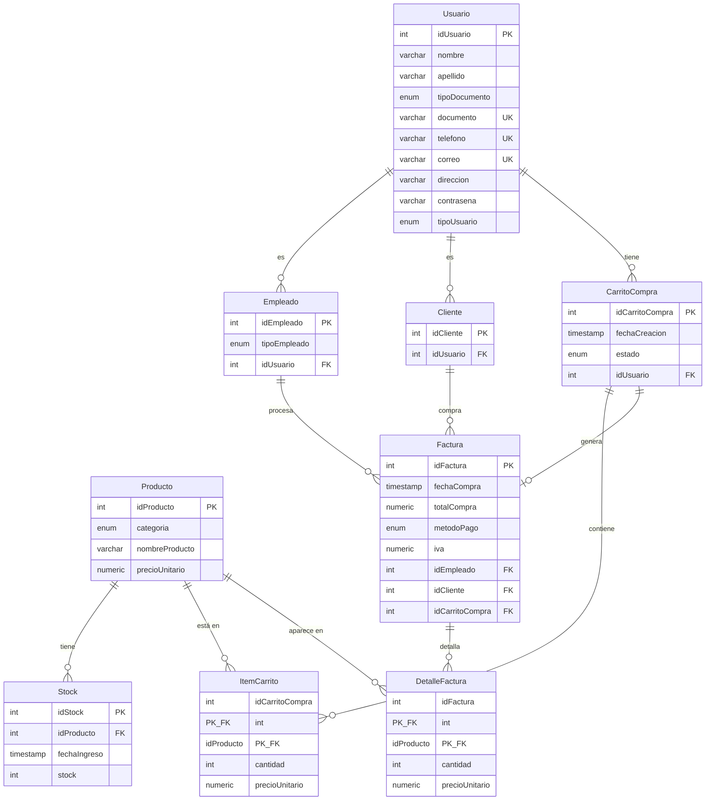

# Base de Datos — TiendaQ

## Resumen

TiendaQ utiliza dos bases de datos:

| Base de datos | Motor        | Propósito                            | Estado        |
| ------------- | ------------ | ------------------------------------ | ------------- |
| `tiendaq`    | PostgreSQL 15+ | Base de datos principal del API    | Activa        |
| `Tienda_Q`    | MySQL 8+     | Base de datos original (referencia)  | Referencia    |

> La base de datos principal es **PostgreSQL**. MySQL se mantiene unicamente como referencia del esquema original.

---

## Scripts Disponibles

| Archivo                    | Motor      | Descripción                                     |
| -------------------------- | ---------- | ----------------------------------------------- |
| `SCRIPTS_POSTGRES.sql`     | PostgreSQL | Creación de tipos ENUM, tablas y relaciones      |
| `SCRIPTS.sql`              | MySQL      | Creacion de tablas (esquema original)             |
| `INSERTS.sql`              | Ambos      | Datos de prueba (50 registros por tabla)          |
| `DELETE.sql`               | PostgreSQL | Limpieza completa con TRUNCATE CASCADE            |

### Cómo ejecutar los scripts

```bash
# PostgreSQL — Crear base de datos
psql -U postgres -c "CREATE DATABASE tiendaq;"

# PostgreSQL — Crear esquema
psql -U postgres -d tiendaq -f app/database/SCRIPTS_POSTGRES.sql

# PostgreSQL — Insertar datos de prueba
psql -U postgres -d tiendaq -f app/database/INSERTS.sql

# PostgreSQL — Limpiar datos (sin eliminar tablas)
psql -U postgres -d tiendaq -f app/database/DELETE.sql
```

```bash
# MySQL (referencia) — Crear base de datos
mysql -u root -p -e "CREATE DATABASE Tienda_Q DEFAULT CHARACTER SET utf8mb4 COLLATE utf8mb4_general_ci;"

# MySQL — Crear esquema
mysql -u root -p Tienda_Q < app/database/SCRIPTS.sql

# MySQL — Insertar datos de prueba
mysql -u root -p Tienda_Q < app/database/INSERTS.sql
```

---

## Tablas

### Diagrama Entidad-Relación



---

### Descripción de Tablas

#### Usuario

Tabla central del sistema. Contiene los datos personales de todas las personas registradas.

| Columna        | Tipo              | Restricción       | Descripción                    |
| -------------- | ----------------- | ----------------- | ------------------------------ |
| `idUsuario`    | SERIAL / INT AUTO | PK                | Identificador único            |
| `nombre`       | VARCHAR(20)       | NOT NULL          | Nombre del usuario             |
| `apellido`     | VARCHAR(20)       | NOT NULL          | Apellido del usuario           |
| `tipoDocumento`| ENUM              | NOT NULL          | CC, TI, CE, PASAPORTE         |
| `documento`    | VARCHAR(20)       | NOT NULL, UNIQUE  | Número de documento            |
| `telefono`     | VARCHAR(20)       | NOT NULL, UNIQUE  | Teléfono de contacto           |
| `correo`       | VARCHAR(70)       | NOT NULL, UNIQUE  | Correo electrónico             |
| `direccion`    | VARCHAR(100)      | NOT NULL          | Dirección de residencia        |
| `contrasena`   | VARCHAR(250)      | NOT NULL          | Contraseña (a hashear)         |
| `tipoUsuario`  | ENUM              | NOT NULL          | REGISTRADO, SIN_REGISTRAR     |

#### Empleado

Extiende a `Usuario` con un rol operativo. Un usuario puede ser empleado.

| Columna        | Tipo              | Restricción       | Descripción                    |
| -------------- | ----------------- | ----------------- | ------------------------------ |
| `idEmpleado`   | SERIAL / INT AUTO | PK                | Identificador único            |
| `tipoEmpleado` | ENUM              | NOT NULL          | ADMINISTRADOR, VENDEDOR        |
| `idUsuario`    | INT               | FK → Usuario      | Relación con usuario base      |

#### Cliente

Extiende a `Usuario` como comprador. Un usuario puede ser cliente.

| Columna        | Tipo              | Restricción       | Descripción                    |
| -------------- | ----------------- | ----------------- | ------------------------------ |
| `idCliente`    | SERIAL / INT AUTO | PK                | Identificador único            |
| `idUsuario`    | INT               | FK → Usuario      | Relación con usuario base      |

#### Producto

Artículos disponibles para la venta en la tienda.

| Columna          | Tipo              | Restricción       | Descripción                    |
| ---------------- | ----------------- | ----------------- | ------------------------------ |
| `idProducto`     | SERIAL / INT AUTO | PK                | Identificador único            |
| `categoria`      | ENUM              | NOT NULL          | ROPA, ACCESORIOS, LIBRERIA, PAPELERIA |
| `nombreProducto` | VARCHAR(50)       | NOT NULL          | Nombre del producto            |
| `precioUnitario` | NUMERIC(10,2)     | NOT NULL          | Precio unitario en COP         |

#### Stock

Control de inventario por producto. Registra entradas de stock.

| Columna        | Tipo              | Restricción       | Descripción                    |
| -------------- | ----------------- | ----------------- | ------------------------------ |
| `idStock`      | SERIAL / INT AUTO | PK                | Identificador único            |
| `idProducto`   | INT               | FK → Producto     | Producto asociado              |
| `fechaIngreso` | TIMESTAMP         | NOT NULL, DEFAULT | Fecha de ingreso al inventario |
| `stock`        | INT               | NOT NULL          | Cantidad disponible            |

#### CarritoCompra

Carrito de compras asociado a un usuario. Tiene estados que reflejan el flujo de compra.

| Columna            | Tipo              | Restricción       | Descripción                    |
| ------------------ | ----------------- | ----------------- | ------------------------------ |
| `idCarritoCompra`  | SERIAL / INT AUTO | PK                | Identificador único            |
| `fechaCreacion`    | TIMESTAMP         | NOT NULL, DEFAULT | Fecha de creación              |
| `estado`           | ENUM              | NOT NULL          | Estado del carrito (ver enums) |
| `idUsuario`        | INT               | FK → Usuario      | Usuario dueño del carrito      |

#### ItemCarrito

Tabla intermedia que relaciona productos con carritos. Clave compuesta.

| Columna            | Tipo              | Restricción            | Descripción                 |
| ------------------ | ----------------- | ---------------------- | --------------------------- |
| `idCarritoCompra`  | INT               | PK, FK → CarritoCompra | Carrito al que pertenece    |
| `idProducto`       | INT               | PK, FK → Producto      | Producto agregado           |
| `cantidad`         | INT               | NOT NULL               | Cantidad del producto       |
| `precioUnitario`   | NUMERIC(10,2)     | NOT NULL               | Precio al momento de agregar|

#### Factura

Registro de una compra completada. Vincula empleado, cliente y carrito.

| Columna            | Tipo              | Restricción            | Descripción                    |
| ------------------ | ----------------- | ---------------------- | ------------------------------ |
| `idFactura`        | SERIAL / INT AUTO | PK                     | Identificador único            |
| `fechaCompra`      | TIMESTAMP         | NOT NULL, DEFAULT      | Fecha de la compra             |
| `totalCompra`      | NUMERIC(10,2)     | NOT NULL               | Total de la compra             |
| `metodoPago`       | ENUM              | NOT NULL               | Método de pago utilizado       |
| `iva`              | NUMERIC(10,2)     | NOT NULL               | Valor del IVA                  |
| `idEmpleado`       | INT               | FK → Empleado          | Empleado que procesó la venta  |
| `idCliente`        | INT               | FK → Cliente           | Cliente que realizó la compra  |
| `idCarritoCompra`  | INT               | FK → CarritoCompra     | Carrito asociado               |

#### DetalleFactura

Línea de detalle de cada factura. Snapshot de productos y precios al momento de la compra.

| Columna          | Tipo              | Restricción            | Descripción                    |
| ---------------- | ----------------- | ---------------------- | ------------------------------ |
| `idFactura`      | INT               | PK, FK → Factura       | Factura a la que pertenece     |
| `idProducto`     | INT               | PK, FK → Producto      | Producto facturado             |
| `cantidad`       | INT               | NOT NULL, CHECK > 0    | Cantidad facturada             |
| `precioUnitario` | NUMERIC(10,2)     | NOT NULL               | Precio al momento de facturar  |

---

## Tipos ENUM (PostgreSQL)

| Nombre                    | Valores                                                                |
| ------------------------- | ---------------------------------------------------------------------- |
| `tipo_documento_enum`     | `CC`, `TI`, `CE`, `PASAPORTE`                                         |
| `tipo_usuario_enum`       | `REGISTRADO`, `SIN_REGISTRAR`                                         |
| `tipo_empleado_enum`      | `ADMINISTRADOR`, `VENDEDOR`                                            |
| `categoria_producto_enum` | `ROPA`, `ACCESORIOS`, `LIBRERIA`, `PAPELERIA`                         |
| `estado_carrito_enum`     | `VACIO`, `CON_PRODUCTOS`, `EN_PROCESO_DE_PAGO`, `PAGO_PENDIENTE`, `PAGO_EXITOSO` |
| `metodo_pago_enum`        | `PSE`, `TARJETA_CREDITO`, `TARJETA_DEBITO`, `EFECTIVO`, `TRANSFERENCIA` |

---

## Datos de Prueba (Seed Data)

El archivo `INSERTS.sql` contiene datos de prueba para todas las tablas:

| Tabla          | Registros | Notas                                         |
| -------------- | --------- | --------------------------------------------- |
| Usuario        | 50        | Datos ficticios, contraseñas en texto plano   |
| Empleado       | 45        | Mix de ADMINISTRADOR y VENDEDOR               |
| Cliente        | 50        | Todos los usuarios son también clientes       |
| Producto       | 50        | 4 categorías, precios en COP                  |
| Stock          | 50        | Stock inicial entre 50 y 200 unidades         |
| CarritoCompra  | 50        | Todos los estados representados               |
| ItemCarrito    | 50        | 2 items por carrito (primeros 25 carritos)    |
| Factura        | 50        | Todos los métodos de pago representados       |

> **Importante:** Los datos de prueba usan contraseñas en texto plano. En producción, todas las contraseñas deben estar hasheadas con BCrypt.

### Orden de inserción

Los inserts deben ejecutarse en el siguiente orden para respetar las foreign keys:

1. `Usuario`
2. `Empleado`
3. `Cliente`
4. `Producto`
5. `Stock`
6. `CarritoCompra`
7. `ItemCarrito`
8. `Factura`

---

## Diferencias entre PostgreSQL y MySQL

| Aspecto              | PostgreSQL                          | MySQL                               |
| -------------------- | ----------------------------------- | ----------------------------------- |
| ENUMs                | Tipos separados (`CREATE TYPE`)     | Inline en columna (`ENUM(...)`)     |
| Auto-incremento      | `SERIAL`                            | `INT AUTO_INCREMENT`                |
| Timestamps           | `TIMESTAMP` con `CURRENT_TIMESTAMP` | `DATE`                              |
| Precisión numérica   | `NUMERIC(10,2)`                     | `FLOAT`                             |
| Dirección (varchar)  | `VARCHAR(100)`                      | `VARCHAR(20)`                       |
| Contraseña (varchar) | `VARCHAR(250)`                      | `VARCHAR(20)`                       |
| DetalleFactura       | Existe                              | No existe en schema original        |
| PK ItemCarrito       | Compuesta (carritoCompra + producto)| `INT AUTO_INCREMENT`                |

> El esquema PostgreSQL es la version mejorada y normalizada. El esquema MySQL es la version original.

---

Documento base — se expandirá conforme avance el desarrollo.
