# TiendaQ -- Documento de Diseno de Software (SDD)

**Proyecto:** TiendaQ - Sistema de Comercio Electronico Universitario  
**Organizacion:** Fundacion Universitaria Konrad Lorenz (FUKL) - Club K-Forge  
**Version:** 2.0  
**Fecha:** Marzo 2026  
**Estado:** Aprobado  
**Documento de referencia:** REQUIREMENTS.md (SRS v2.0, 72 RF + 22 RNF)

---

## 1. Introduccion

### 1.1 Proposito

Este documento define el Diseno de Software (SDD) para **TiendaQ**, estableciendo la arquitectura del sistema, el modelo de datos, los patrones de diseno aplicados, los diagramas de comportamiento y el diseno de la API REST. El documento sirve como referencia tecnica para la implementacion y como instrumento de evaluacion academica.

El documento esta dirigido a:

- Desarrolladores del equipo K-Forge responsables de la implementacion.
- Docentes y evaluadores academicos que verifican la calidad arquitectonica del sistema.
- Testers que requieren comprender la estructura interna para disenar pruebas.

### 1.2 Alcance

El SDD cubre el diseno completo de TiendaQ en sus tres componentes:

- **Frontend**: SPA en Angular 21 con standalone components, Angular Router y SCSS, comunicandose via HTTP/JSON con el backend.
- **Backend**: API REST en Spring Boot 4.0 con Java 25, implementando una arquitectura en capas (Controller, Service, Repository, Model).
- **Base de datos**: PostgreSQL 15+ como unico motor de persistencia con esquema relacional normalizado.

**Fuera del alcance del diseno:** Infraestructura de despliegue en produccion, integracion con pasarelas de pago reales, servicios de correo electronico transaccional.

### 1.3 Definiciones y acronimos

| Termino | Definicion |
| --- | --- |
| SDD | Documento de Diseno de Software (Software Design Document) |
| SRS | Especificacion de Requerimientos de Software (Software Requirements Specification) |
| C4 Model | Modelo de diagramacion arquitectonica en cuatro niveles: Contexto, Contenedores, Componentes, Codigo |
| JPA | Java Persistence API -- especificacion para mapeo objeto-relacional |
| ORM | Mapeo Objeto-Relacional (Object-Relational Mapping) |
| DTO | Objeto de Transferencia de Datos (Data Transfer Object) |
| CRUD | Operaciones basicas: Crear, Leer, Actualizar, Eliminar |
| JWT | JSON Web Token -- estandar para transmitir informacion de autenticacion |
| SPA | Aplicacion de Pagina Unica (Single Page Application) |
| IVA | Impuesto al Valor Agregado (19% en Colombia) |
| Entidad de dominio | Clase que representa un concepto del negocio y se mapea a una tabla de la base de datos |

---

## 2. Stack tecnologico

La siguiente tabla refleja las tecnologias y versiones reales utilizadas en el proyecto, extraidas de `pom.xml` y `package.json`.

| Capa | Tecnologia | Version | Proposito |
| --- | --- | --- | --- |
| Lenguaje backend | Java | 25 | Lenguaje principal del servidor |
| Framework backend | Spring Boot | 4.0.0 | Framework para la API REST |
| Persistencia | Spring Data JPA (Hibernate) | -- | ORM y acceso a datos |
| Seguridad | Spring Security + OAuth2 Client | -- | Autenticacion y autorizacion |
| Validacion | Spring Validation (Jakarta) | -- | Validacion de DTOs de entrada |
| Monitoreo | Spring Actuator | -- | Health checks y metricas |
| Web | Spring WebMVC | -- | Controladores REST |
| Utilidades | Lombok | -- | Reduccion de boilerplate (getters, setters, constructores) |
| Desarrollo | Spring DevTools | -- | Recarga en caliente durante desarrollo |
| Base de datos | PostgreSQL | 15+ | Motor de persistencia relacional |
| Driver JDBC | PostgreSQL Driver | -- | Conectividad Java-PostgreSQL |
| Build backend | Maven | 3.9+ | Gestion de dependencias y compilacion |
| Lenguaje frontend | TypeScript | ~5.9 | Lenguaje del cliente |
| Framework frontend | Angular | 21.2.0 | Framework de interfaces de usuario |
| CLI frontend | Angular CLI | 21.2.2 | Herramienta de desarrollo y build |
| Routing | Angular Router | -- | Navegacion SPA |
| HTTP Client | Angular HttpClient | -- | Comunicacion con la API REST |
| Estilos | SCSS | -- | Preprocesador de estilos |
| Package manager | pnpm + Bun | -- | pnpm para dependencias, Bun para ejecucion |

---

## 3. Arquitectura del sistema

### 3.1 Diagrama de contexto (C4 -- Nivel 1)

El diagrama de contexto muestra el sistema TiendaQ y sus interacciones con los actores externos. En este nivel, el sistema se presenta como una caja negra.

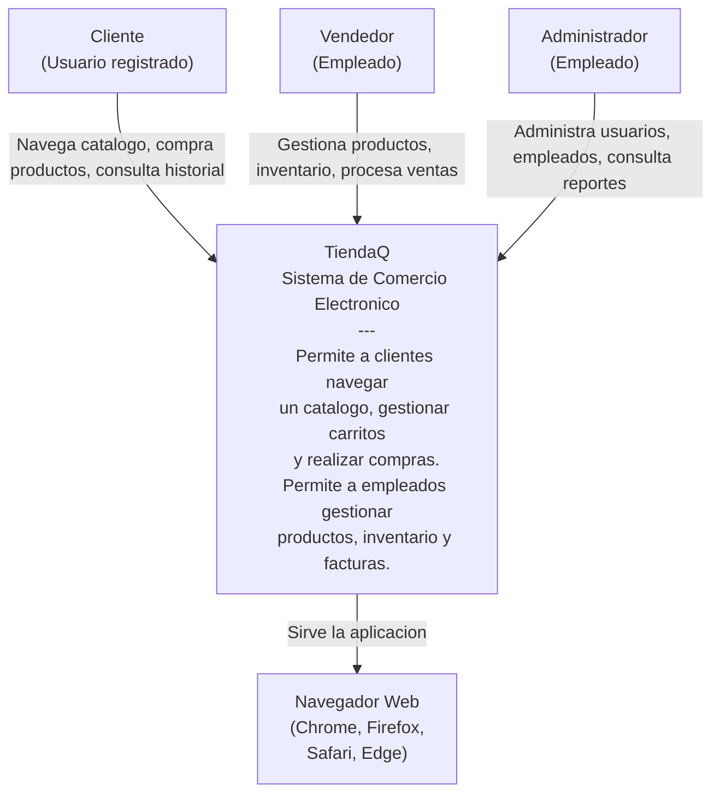

### 3.2 Diagrama de contenedores (C4 -- Nivel 2)

El diagrama de contenedores descompone el sistema en sus tres contenedores ejecutables y muestra las tecnologias y protocolos de comunicacion entre ellos.

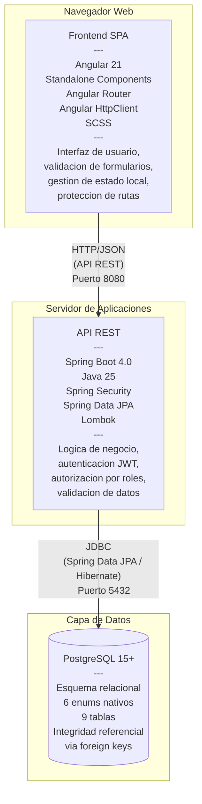

### 3.3 Arquitectura del backend (capas)

El backend implementa una **arquitectura en capas** (Layered Architecture), el patron estandar de Spring Boot. Cada capa tiene una responsabilidad unica y solo puede depender de la capa inmediatamente inferior. Esta restriccion garantiza la separacion de responsabilidades y facilita la testeabilidad.

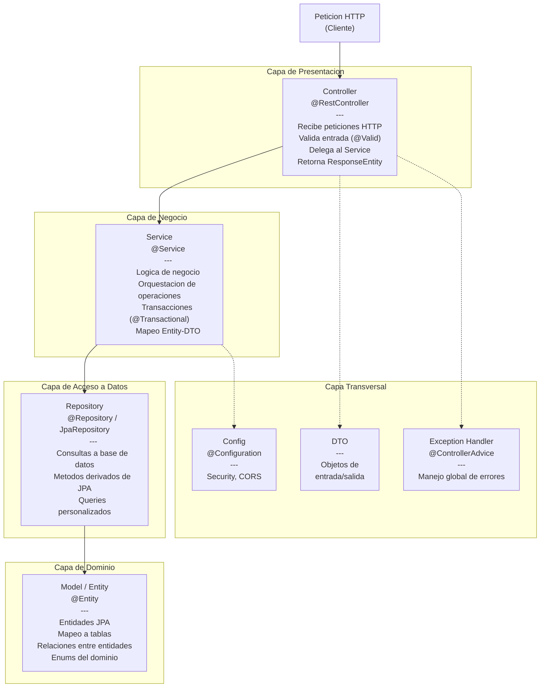

**Reglas de dependencia:**

| Capa | Puede depender de | NO puede depender de |
| --- | --- | --- |
| Controller | Service, DTO, Exception Handler | Repository, Model (directamente) |
| Service | Repository, Model, DTO | Controller |
| Repository | Model | Controller, Service |
| Model / Entity | Enums del dominio | Ninguna otra capa |
| Config | -- | Capas de negocio |

### 3.4 Estructura de paquetes

```
com.tiendaq.api
├── TiendaQApplication.java            -- Clase principal (@SpringBootApplication)
├── config/                             -- Configuraciones de Spring (pendiente)
├── controller/                         -- Controladores REST
│   ├── CarritoController.java
│   ├── ClienteController.java
│   ├── EmpleadoController.java
│   ├── FacturaController.java
│   ├── ItemController.java
│   ├── ProductoController.java
│   ├── StockController.java
│   └── UsuarioController.java
├── dto/                                -- Objetos de transferencia de datos (pendiente)
├── exception/                          -- Manejo global de excepciones (pendiente)
├── model/                              -- Entidades JPA
│   ├── enums/                          -- Enumeraciones del dominio
│   │   ├── Categoria.java
│   │   ├── Estado.java
│   │   ├── MetodoPago.java
│   │   ├── TipoDocumento.java
│   │   ├── TipoEmpleado.java
│   │   └── TipoUsuario.java
│   ├── Carrito.java
│   ├── Cliente.java
│   ├── Empleado.java
│   ├── Factura.java
│   ├── Items.java
│   ├── Producto.java
│   ├── Stock.java
│   └── Usuario.java
├── repository/                         -- Interfaces de acceso a datos
│   ├── CarritoRepository.java
│   ├── ClienteRepository.java
│   ├── EmpleadoRepository.java
│   ├── FacturaRepository.java
│   ├── ItemRepository.java
│   ├── ProductoRepository.java
│   ├── StockRepository.java
│   └── UsuarioRepository.java
└── service/                            -- Logica de negocio
    ├── CarritoService.java
    ├── ClienteService.java
    ├── EmpleadoService.java
    ├── FacturaService.java
    ├── ItemService.java
    ├── ProductoService.java
    ├── StockService.java
    └── UsuarioService.java
```

---

## 4. Modelo de datos

### 4.1 Que son las entidades de dominio

Las **entidades de dominio** son las clases que representan los conceptos fundamentales del negocio. En el contexto de TiendaQ, cada entidad modela un objeto del mundo real del comercio electronico: un usuario, un producto, una factura, etc.

En terminos tecnicos, cada entidad de dominio:

- Se mapea a una **tabla** en la base de datos PostgreSQL mediante anotaciones JPA (`@Entity`, `@Table`).
- Define los **atributos** del concepto de negocio (campos que se convierten en columnas).
- Establece las **relaciones** con otras entidades (`@ManyToOne`, `@OneToMany`, claves foraneas).
- Utiliza **enums** para campos con valores finitos y predefinidos (categorias, estados, roles).

Las entidades son el nucleo del sistema: toda la logica de negocio opera sobre ellas, y todo lo que se persiste en la base de datos pasa por ellas.

### 4.2 Diagrama entidad-relacion

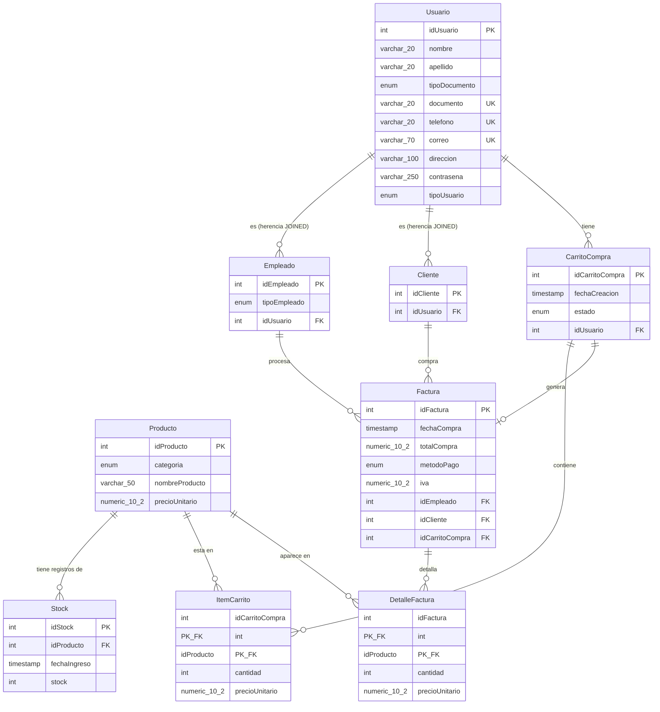

### 4.3 Descripcion de entidades

A continuacion se describe cada entidad del dominio con sus campos reales, derivados de las clases JPA del proyecto y del esquema PostgreSQL.

#### 4.3.1 Usuario

Representa a cualquier persona registrada en el sistema. Es la entidad base de la jerarquia de herencia (estrategia `JOINED`): tanto `Empleado` como `Cliente` extienden de `Usuario`.

**Clase JPA:** `com.tiendaq.api.model.Usuario`  
**Tabla:** `Usuario`  
**Estrategia de herencia:** `InheritanceType.JOINED`

| Campo | Tipo Java | Tipo SQL | Restricciones | Descripcion |
| --- | --- | --- | --- | --- |
| idUsuario | int | SERIAL | PK, auto-generado | Identificador unico del usuario |
| nombre | String | VARCHAR(20) | NOT NULL | Nombre del usuario |
| apellido | String | VARCHAR(20) | NOT NULL | Apellido del usuario |
| tipoDocumento | TipoDocumento (enum) | tipo_documento_enum | NOT NULL | Tipo de documento de identidad |
| documento | String | VARCHAR(20) | NOT NULL, UNIQUE | Numero de documento de identidad |
| telefono | String | VARCHAR(20) | NOT NULL, UNIQUE | Numero de telefono |
| correo | String | VARCHAR(70) | NOT NULL, UNIQUE | Correo electronico |
| direccion | String | VARCHAR(100) | NOT NULL | Direccion fisica |
| contrasena | String | VARCHAR(250) | NOT NULL | Contrasena hasheada con BCrypt |
| tipoUsuario | TipoUsuario (enum) | tipo_usuario_enum | NOT NULL | Tipo de usuario: REGISTRADO o SIN_REGISTRAR |

#### 4.3.2 Empleado

Representa a un trabajador del sistema (vendedor o administrador). Hereda todos los campos de `Usuario` via JPA JOINED inheritance, y anade sus campos propios.

**Clase JPA:** `com.tiendaq.api.model.Empleado`  
**Tabla:** `Empleado`  
**Extiende:** `Usuario` (via `@PrimaryKeyJoinColumn(name = "idUsuario")`)

| Campo | Tipo Java | Tipo SQL | Restricciones | Descripcion |
| --- | --- | --- | --- | --- |
| idEmpleado | int | SERIAL | Generado | Identificador especifico de empleado |
| tipoEmpleado | TipoEmpleado (enum) | tipo_empleado_enum | NOT NULL | Rol: ADMINISTRADOR o VENDEDOR |
| idUsuario | int | INT | FK -> Usuario(idUsuario) | Referencia al usuario base (clave de join) |

#### 4.3.3 Cliente

Representa a un comprador registrado. Hereda todos los campos de `Usuario`.

**Clase JPA:** `com.tiendaq.api.model.Cliente`  
**Tabla:** `Cliente`  
**Extiende:** `Usuario` (via `@PrimaryKeyJoinColumn(name = "idUsuario")`)

| Campo | Tipo Java | Tipo SQL | Restricciones | Descripcion |
| --- | --- | --- | --- | --- |
| idCliente | int | SERIAL | Generado | Identificador especifico de cliente |
| idUsuario | int | INT | FK -> Usuario(idUsuario) | Referencia al usuario base (clave de join) |

#### 4.3.4 Producto

Representa un articulo disponible para la venta en el catalogo de TiendaQ.

**Clase JPA:** `com.tiendaq.api.model.Producto`  
**Tabla:** `Producto`

| Campo | Tipo Java | Tipo SQL | Restricciones | Descripcion |
| --- | --- | --- | --- | --- |
| idProducto | int | SERIAL | PK, auto-generado | Identificador unico del producto |
| categoria | Categoria (enum) | categoria_producto_enum | NOT NULL | Categoria del producto |
| nombre | String | VARCHAR(50) | NOT NULL | Nombre del producto (mapeado a `nombreproducto`) |
| precioUnitario | double | NUMERIC(10,2) | NOT NULL | Precio unitario sin IVA |

#### 4.3.5 Stock

Representa un registro de ingreso de inventario para un producto. Cada entrada registra una cantidad y la fecha en que fue ingresada. El stock total de un producto se calcula sumando todos sus registros de stock menos las cantidades vendidas.

**Clase JPA:** `com.tiendaq.api.model.Stock`  
**Tabla:** `Stock`

| Campo | Tipo Java | Tipo SQL | Restricciones | Descripcion |
| --- | --- | --- | --- | --- |
| idStock | int | SERIAL | PK, auto-generado | Identificador del registro de stock |
| fechaIngreso | LocalDateTime | TIMESTAMP | NOT NULL, DEFAULT CURRENT_TIMESTAMP | Fecha y hora del ingreso |
| stock | int | INT | NOT NULL | Cantidad ingresada |
| producto | Producto | INT | FK -> Producto(idProducto), NOT NULL | Producto al que pertenece el ingreso |

#### 4.3.6 CarritoCompra

Representa el carrito de compras de un usuario. Sigue una maquina de estados que controla el ciclo de vida de la compra (ver seccion 5.3).

**Clase JPA:** `com.tiendaq.api.model.Carrito`  
**Tabla:** `CarritoCompra`

| Campo | Tipo Java | Tipo SQL | Restricciones | Descripcion |
| --- | --- | --- | --- | --- |
| idCarrito | int | SERIAL | PK, auto-generado | Identificador del carrito (mapeado a `idcarritocompra`) |
| fechaCreacion | LocalDateTime | TIMESTAMP | NOT NULL, DEFAULT CURRENT_TIMESTAMP | Fecha de creacion del carrito |
| estado | Estado (enum) | estado_carrito_enum | NOT NULL | Estado actual del carrito |
| usuario | Usuario | INT | FK -> Usuario(idUsuario), NOT NULL | Usuario propietario del carrito |

#### 4.3.7 ItemCarrito

Representa un producto dentro de un carrito con su cantidad y precio al momento de agregarlo. Usa una **clave compuesta** (idCarritoCompra + idProducto) que modela la relacion muchos-a-muchos entre CarritoCompra y Producto.

**Clase JPA:** `com.tiendaq.api.model.Items`  
**Tabla:** `ItemCarrito`  
**Clave compuesta:** `Items.ItemId` (idCarrito + idProducto) via `@IdClass`

| Campo | Tipo Java | Tipo SQL | Restricciones | Descripcion |
| --- | --- | --- | --- | --- |
| carrito | Carrito | INT | PK (parcial), FK -> CarritoCompra(idCarritoCompra) | Carrito al que pertenece el item |
| producto | Producto | INT | PK (parcial), FK -> Producto(idProducto) | Producto agregado al carrito |
| cantidad | int | INT | NOT NULL | Cantidad del producto en el carrito |
| precioUnitario | double | NUMERIC(10,2) | NOT NULL | Precio unitario al momento de agregar |

#### 4.3.8 Factura

Representa una transaccion de compra completada. Contiene los totales calculados, el metodo de pago y las referencias al cliente, empleado y carrito que originaron la compra.

**Clase JPA:** `com.tiendaq.api.model.Factura`  
**Tabla:** `Factura`

| Campo | Tipo Java | Tipo SQL | Restricciones | Descripcion |
| --- | --- | --- | --- | --- |
| idFactura | int | SERIAL | PK, auto-generado | Numero de factura |
| fechaCompra | LocalDateTime | TIMESTAMP | NOT NULL, DEFAULT CURRENT_TIMESTAMP | Fecha y hora de la compra |
| totalCompra | double | NUMERIC(10,2) | NOT NULL | Total de la compra (subtotal + IVA) |
| metodoPago | MetodoPago (enum) | metodo_pago_enum | NOT NULL | Metodo de pago utilizado |
| iva | double | NUMERIC(10,2) | NOT NULL | Monto del IVA (19%) |
| empleado | Empleado | INT | FK -> Empleado(idEmpleado), NOT NULL | Empleado que proceso la factura |
| cliente | Cliente | INT | FK -> Cliente(idCliente), NOT NULL | Cliente que realizo la compra |
| carrito | Carrito | INT | FK -> CarritoCompra(idCarritoCompra), NOT NULL | Carrito de origen |

#### 4.3.9 DetalleFactura

Snapshot de cada producto comprado al momento de la facturacion. Preserva el precio y cantidad como datos historicos inmutables. Usa clave compuesta (idFactura + idProducto).

**Tabla SQL:** `DetalleFactura`  
**Nota:** Esta entidad esta definida en el esquema SQL pero aun no tiene clase JPA dedicada en el proyecto; sera implementada como entidad con `@IdClass` o `@EmbeddedId`.

| Campo | Tipo SQL | Restricciones | Descripcion |
| --- | --- | --- | --- |
| idFactura | INT | PK (parcial), FK -> Factura(idFactura) | Factura a la que pertenece |
| idProducto | INT | PK (parcial), FK -> Producto(idProducto) | Producto facturado |
| cantidad | INT | NOT NULL, CHECK (cantidad > 0) | Cantidad vendida |
| precioUnitario | NUMERIC(10,2) | NOT NULL | Precio unitario al momento de la compra |

### 4.4 Enums del dominio

Los enums representan campos con un conjunto finito y cerrado de valores validos. En PostgreSQL se implementan como tipos ENUM nativos; en Java como enumeraciones que se mapean via `@Enumerated(EnumType.STRING)`.

| Enum (Java) | Tipo PostgreSQL | Valores | Uso |
| --- | --- | --- | --- |
| TipoDocumento | tipo_documento_enum | CC, TI, CE, PASAPORTE, NIT, RUT, OTRO | Tipo de documento del usuario |
| TipoUsuario | tipo_usuario_enum | REGISTRADO, SIN_REGISTRAR | Estado de registro del usuario |
| TipoEmpleado | tipo_empleado_enum | ADMINISTRADOR, VENDEDOR | Rol del empleado en el sistema |
| Categoria | categoria_producto_enum | ROPA, ACCESORIOS, LIBRERIA, PAPELERIA | Categoria del producto |
| Estado | estado_carrito_enum | VACIO, CON_PRODUCTOS, EN_PROCESO_DE_PAGO, PAGO_PENDIENTE, PAGO_EXITOSO | Estado del carrito de compras |
| MetodoPago | metodo_pago_enum | PSE, TARJETA_CREDITO, TARJETA_DEBITO, EFECTIVO, TRANSFERENCIA | Forma de pago de la factura |

**Nota:** El enum `TipoDocumento` en Java incluye los valores NIT, RUT y OTRO, que no estan presentes en el tipo PostgreSQL `tipo_documento_enum` (que solo define CC, TI, CE, PASAPORTE). Esta discrepancia debera alinearse durante la implementacion.

---

## 5. Diagramas de comportamiento

### 5.1 Diagramas de casos de uso

#### 5.1.1 Casos de uso: Autenticacion y autorizacion

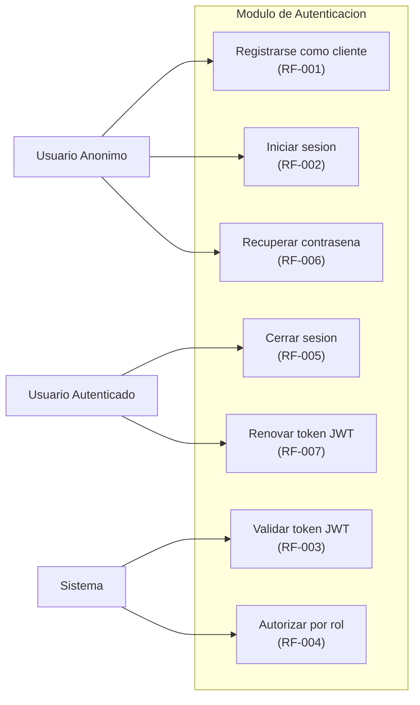

#### 5.1.2 Casos de uso: Compras (catalogo, carrito, checkout)

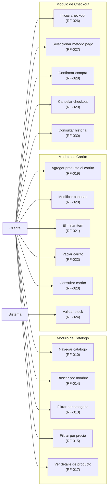

#### 5.1.3 Casos de uso: Administracion (usuarios, inventario, reportes)

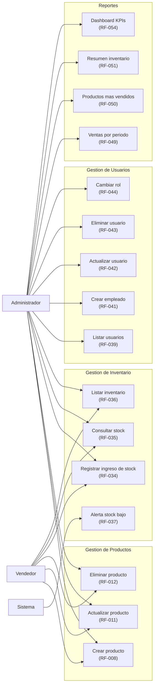

### 5.2 Diagramas de secuencia

#### 5.2.1 Inicio de sesion (Login)

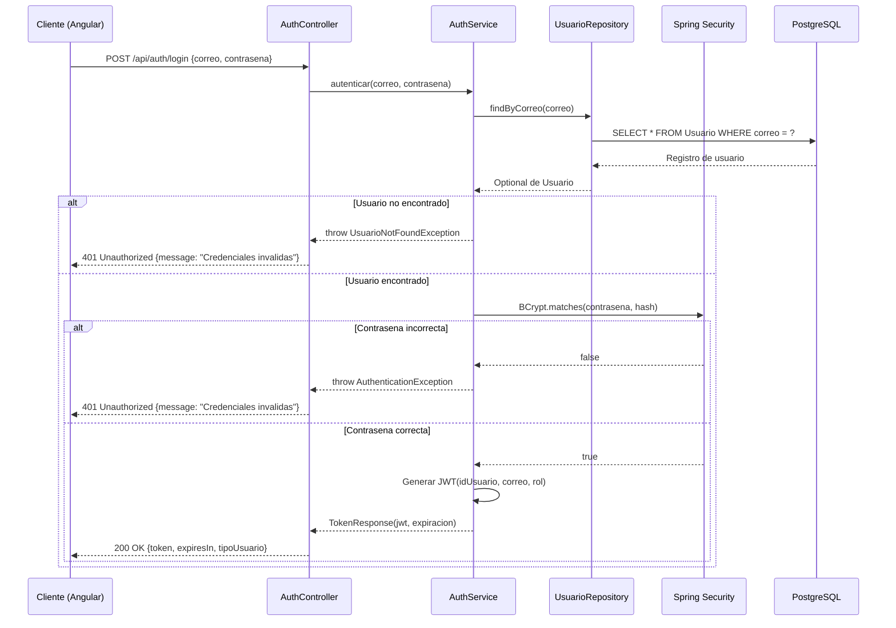

#### 5.2.2 Registro de cliente

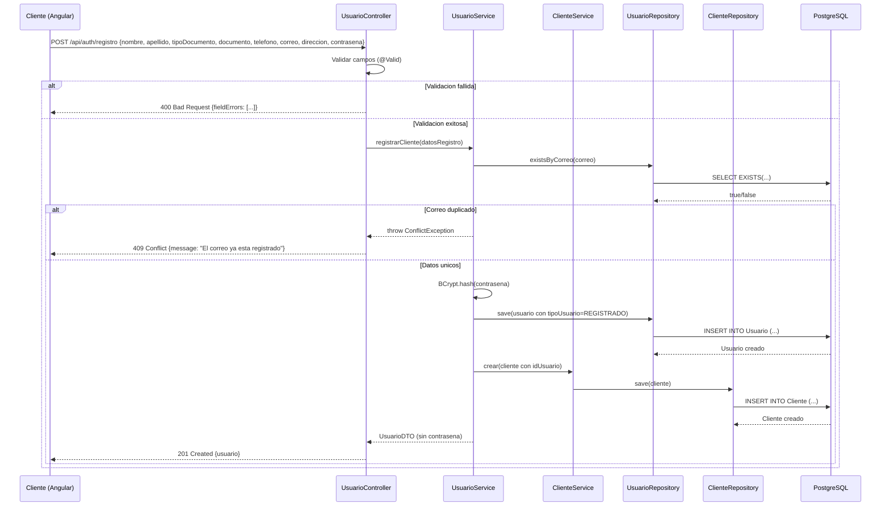

#### 5.2.3 Navegar catalogo y buscar productos

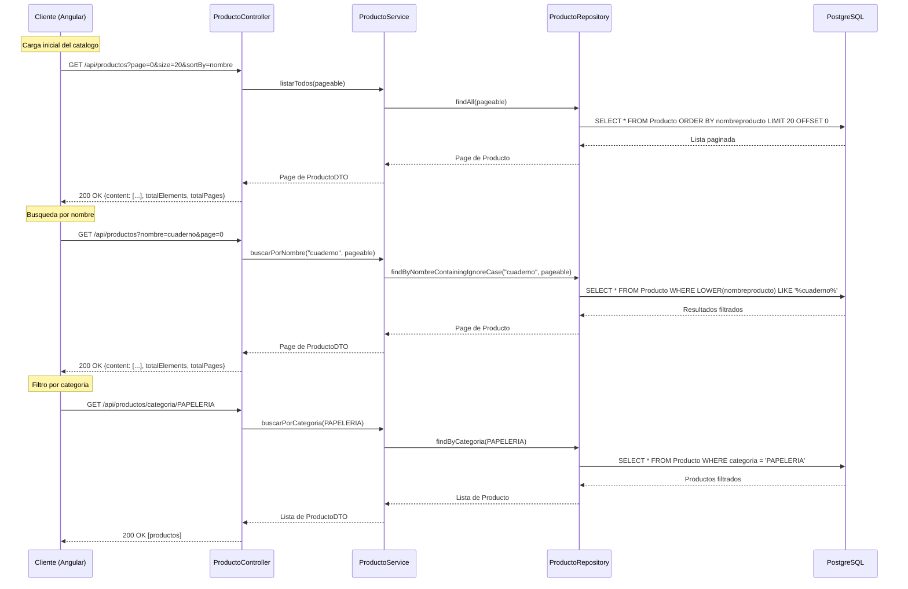

#### 5.2.4 Agregar producto al carrito

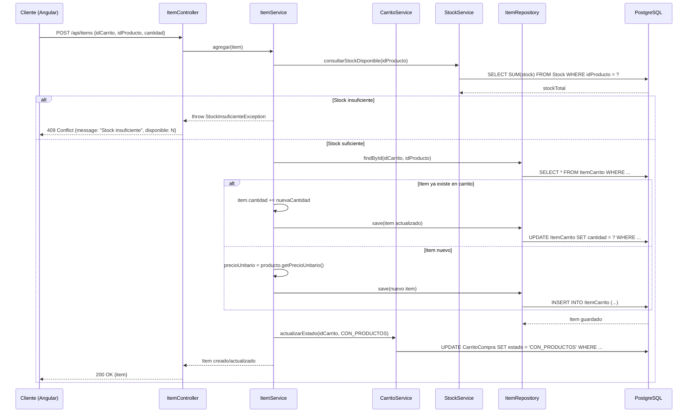

#### 5.2.5 Checkout y generacion de factura

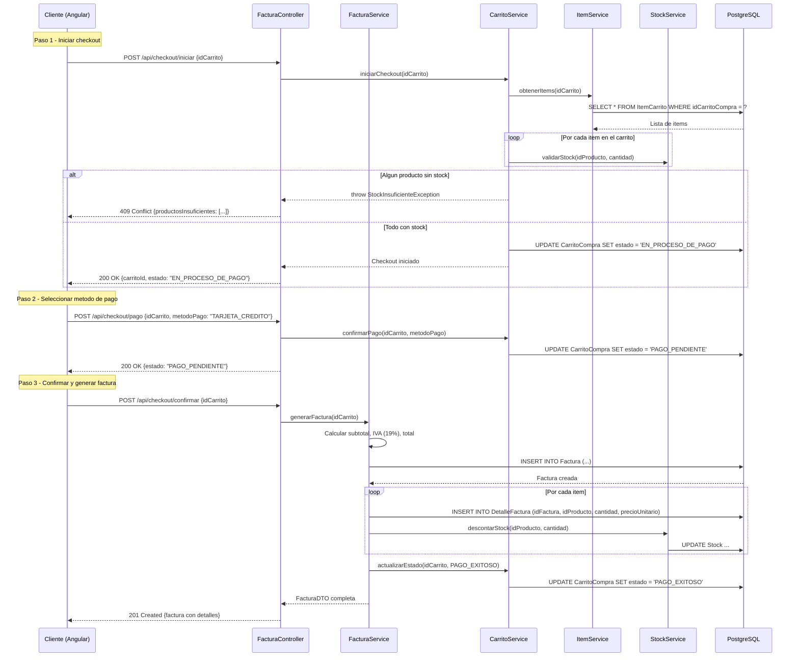

#### 5.2.6 Gestion de inventario (registrar ingreso de stock)

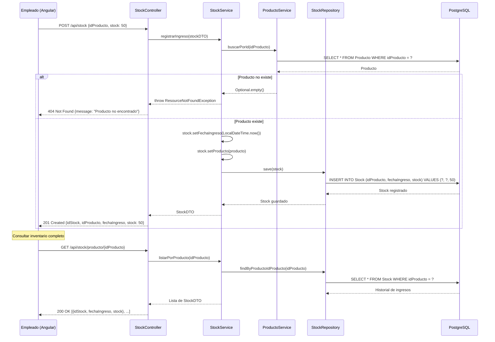

### 5.3 Diagramas de estados

#### 5.3.1 Estados del carrito de compras

El carrito sigue una maquina de estados finita con transiciones controladas. Cualquier transicion no listada es invalida y el sistema la rechaza con HTTP 400.

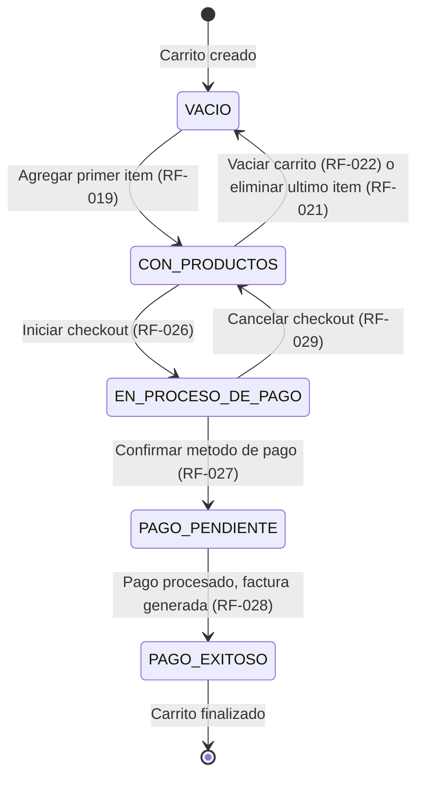

**Transiciones validas:**

| Estado origen | Estado destino | Accion disparadora | RF |
| --- | --- | --- | --- |
| (nuevo) | VACIO | Crear carrito | RF-018 |
| VACIO | CON_PRODUCTOS | Agregar item al carrito | RF-019 |
| CON_PRODUCTOS | VACIO | Vaciar carrito o eliminar ultimo item | RF-021, RF-022 |
| CON_PRODUCTOS | EN_PROCESO_DE_PAGO | Iniciar checkout | RF-026 |
| EN_PROCESO_DE_PAGO | CON_PRODUCTOS | Cancelar checkout | RF-029 |
| EN_PROCESO_DE_PAGO | PAGO_PENDIENTE | Confirmar metodo de pago | RF-027 |
| PAGO_PENDIENTE | PAGO_EXITOSO | Generar factura exitosamente | RF-028 |

#### 5.3.2 Ciclo de vida de una factura

La factura es un registro inmutable una vez creado. Su ciclo de vida esta acoplado al del carrito.

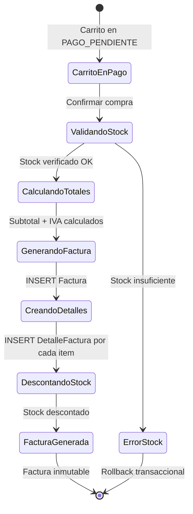

---

## 6. Diseno de API REST

### 6.1 Convenciones

La API REST sigue las siguientes convenciones de diseno:

| Aspecto | Convencion |
| --- | --- |
| Base URL | `/api/` |
| Formato | JSON (`Content-Type: application/json`) |
| Nombres de recursos | Sustantivos en plural y minusculas (`/api/productos`, `/api/usuarios`) |
| Identificadores | Segmentos de ruta (`/api/productos/{id}`) |
| Paginacion | Parametros `page` (0-indexed) y `size` (default: 20, max: 100) |
| Ordenamiento | Parametros `sortBy` y `direction` (ASC/DESC) |
| Filtros | Parametros de query (`?categoria=ROPA&nombre=cuaderno`) |
| Autenticacion | Header `Authorization: Bearer {JWT}` |
| Codigos HTTP | 200 (OK), 201 (Created), 204 (No Content), 400 (Bad Request), 401 (Unauthorized), 403 (Forbidden), 404 (Not Found), 409 (Conflict) |
| Errores | Formato estandarizado con timestamp, status, error, message, path (RF-058) |

### 6.2 Mapa de endpoints por modulo

#### 6.2.1 Autenticacion (`/api/auth`)

| Metodo | Ruta | Descripcion | Autenticacion | RF |
| --- | --- | --- | --- | --- |
| POST | `/api/auth/registro` | Registrar nuevo cliente | No | RF-001 |
| POST | `/api/auth/login` | Iniciar sesion, obtener JWT | No | RF-002 |
| POST | `/api/auth/logout` | Cerrar sesion (invalidar token) | Si | RF-005 |
| POST | `/api/auth/recuperar` | Solicitar recuperacion de contrasena | No | RF-006 |
| POST | `/api/auth/renovar` | Renovar token JWT | Si | RF-007 |

#### 6.2.2 Usuarios (`/api/usuarios`)

| Metodo | Ruta | Descripcion | Autenticacion | RF |
| --- | --- | --- | --- | --- |
| GET | `/api/usuarios` | Listar todos los usuarios (paginado) | ADMINISTRADOR | RF-039 |
| GET | `/api/usuarios/{id}` | Consultar usuario por ID | ADMINISTRADOR | RF-040 |
| POST | `/api/usuarios` | Crear usuario | ADMINISTRADOR | RF-041 |
| PUT | `/api/usuarios/{id}` | Actualizar datos de usuario | ADMINISTRADOR | RF-042 |
| DELETE | `/api/usuarios/{id}` | Eliminar usuario | ADMINISTRADOR | RF-043 |

#### 6.2.3 Clientes (`/api/clientes`)

| Metodo | Ruta | Descripcion | Autenticacion | RF |
| --- | --- | --- | --- | --- |
| GET | `/api/clientes/{idUsuario}` | Consultar cliente por ID de usuario | Si | RF-040 |
| POST | `/api/clientes` | Crear registro de cliente | Si | RF-001 |
| PUT | `/api/clientes/{idUsuario}` | Actualizar datos de cliente | Si | RF-042 |

#### 6.2.4 Empleados (`/api/empleados`)

| Metodo | Ruta | Descripcion | Autenticacion | RF |
| --- | --- | --- | --- | --- |
| GET | `/api/empleados/{id}` | Consultar empleado por ID | ADMINISTRADOR | RF-040 |
| GET | `/api/empleados/usuario/{idUsuario}` | Consultar empleado por ID de usuario | ADMINISTRADOR | RF-040 |

#### 6.2.5 Productos (`/api/productos`)

| Metodo | Ruta | Descripcion | Autenticacion | RF |
| --- | --- | --- | --- | --- |
| GET | `/api/productos` | Listar todos los productos (paginado) | No | RF-010 |
| GET | `/api/productos/{id}` | Consultar producto por ID | No | RF-009 |
| GET | `/api/productos/categoria/{categoria}` | Filtrar productos por categoria | No | RF-013 |
| POST | `/api/productos` | Crear producto | VENDEDOR, ADMINISTRADOR | RF-008 |
| PUT | `/api/productos/{id}` | Actualizar producto | VENDEDOR, ADMINISTRADOR | RF-011 |
| DELETE | `/api/productos/{id}` | Eliminar producto | VENDEDOR, ADMINISTRADOR | RF-012 |

#### 6.2.6 Stock (`/api/stock`)

| Metodo | Ruta | Descripcion | Autenticacion | RF |
| --- | --- | --- | --- | --- |
| GET | `/api/stock/producto/{idProducto}` | Listar registros de stock por producto | VENDEDOR, ADMINISTRADOR | RF-035 |
| GET | `/api/stock/{id}` | Consultar registro de stock por ID | VENDEDOR, ADMINISTRADOR | RF-035 |
| POST | `/api/stock` | Registrar ingreso de stock | VENDEDOR, ADMINISTRADOR | RF-034 |
| PUT | `/api/stock/{id}` | Actualizar registro de stock | ADMINISTRADOR | RF-038 |
| DELETE | `/api/stock/{id}` | Eliminar registro de stock | ADMINISTRADOR | RF-038 |

#### 6.2.7 Carritos (`/api/carritos`)

| Metodo | Ruta | Descripcion | Autenticacion | RF |
| --- | --- | --- | --- | --- |
| GET | `/api/carritos/usuario/{idUsuario}` | Listar carritos de un usuario | Si (propietario) | RF-023 |
| GET | `/api/carritos/{id}` | Consultar carrito por ID | Si (propietario) | RF-023 |
| POST | `/api/carritos` | Crear carrito | Si | RF-018 |
| PUT | `/api/carritos/{id}` | Actualizar carrito (estado) | Si (propietario) | RF-025 |
| DELETE | `/api/carritos/{id}` | Eliminar carrito | Si (propietario) | RF-022 |

#### 6.2.8 Items del carrito (`/api/items`)

| Metodo | Ruta | Descripcion | Autenticacion | RF |
| --- | --- | --- | --- | --- |
| GET | `/api/items/carrito/{idCarrito}` | Listar items de un carrito | Si (propietario) | RF-023 |
| POST | `/api/items` | Agregar item al carrito | Si (propietario) | RF-019 |
| PUT | `/api/items` | Actualizar cantidad de item | Si (propietario) | RF-020 |
| DELETE | `/api/items/{idCarrito}/{idProducto}` | Eliminar item del carrito | Si (propietario) | RF-021 |

#### 6.2.9 Facturas (`/api/facturas`)

| Metodo | Ruta | Descripcion | Autenticacion | RF |
| --- | --- | --- | --- | --- |
| GET | `/api/facturas/cliente/{idCliente}` | Listar facturas de un cliente | Si (propietario), VENDEDOR, ADMINISTRADOR | RF-030 |
| GET | `/api/facturas/{id}` | Consultar detalle de factura | Si (propietario), VENDEDOR, ADMINISTRADOR | RF-031 |
| POST | `/api/facturas` | Generar factura | Si | RF-028 |

#### 6.2.10 Checkout (`/api/checkout`) -- Pendiente de implementacion

| Metodo | Ruta | Descripcion | Autenticacion | RF |
| --- | --- | --- | --- | --- |
| POST | `/api/checkout/iniciar` | Iniciar proceso de checkout | Si (propietario) | RF-026 |
| POST | `/api/checkout/pago` | Confirmar metodo de pago | Si (propietario) | RF-027 |
| POST | `/api/checkout/confirmar` | Confirmar compra y generar factura | Si (propietario) | RF-028 |
| POST | `/api/checkout/cancelar` | Cancelar checkout | Si (propietario) | RF-029 |

#### 6.2.11 Perfil (`/api/perfil`) -- Pendiente de implementacion

| Metodo | Ruta | Descripcion | Autenticacion | RF |
| --- | --- | --- | --- | --- |
| GET | `/api/perfil` | Consultar perfil del usuario autenticado | Si | RF-046 |
| PUT | `/api/perfil` | Actualizar perfil propio | Si | RF-047 |
| PUT | `/api/perfil/contrasena` | Cambiar contrasena | Si | RF-048 |

#### 6.2.12 Reportes (`/api/reportes`) -- Pendiente de implementacion

| Metodo | Ruta | Descripcion | Autenticacion | RF |
| --- | --- | --- | --- | --- |
| GET | `/api/reportes/ventas` | Reporte de ventas por periodo | ADMINISTRADOR | RF-049 |
| GET | `/api/reportes/productos-top` | Productos mas vendidos | ADMINISTRADOR | RF-050 |
| GET | `/api/reportes/inventario` | Resumen de inventario | ADMINISTRADOR | RF-051 |
| GET | `/api/reportes/ventas-categoria` | Ventas por categoria | ADMINISTRADOR | RF-052 |
| GET | `/api/reportes/ventas-empleado` | Ventas por empleado | ADMINISTRADOR | RF-053 |
| GET | `/api/reportes/dashboard` | Dashboard de KPIs | ADMINISTRADOR | RF-054 |

---

## 7. Cobertura de modulos del SRS

La siguiente tabla mapea cada modulo del SRS con su cobertura en este SDD, asegurando trazabilidad completa entre los 72 requerimientos funcionales y el diseno.

| Modulo SRS | Requerimientos | Secciones SDD |
| --- | --- | --- |
| Autenticacion y autorizacion | RF-001 a RF-007 | 5.1.1, 5.2.1, 5.2.2, 6.2.1 |
| Gestion de productos | RF-008 a RF-013 | 4.3.4, 5.1.3, 5.2.3, 6.2.5 |
| Catalogo y busqueda | RF-014 a RF-017 | 5.1.2, 5.2.3, 6.2.5 |
| Carrito de compras | RF-018 a RF-025 | 4.3.6, 4.3.7, 5.1.2, 5.2.4, 5.3.1, 6.2.7, 6.2.8 |
| Checkout y facturacion | RF-026 a RF-033 | 4.3.8, 4.3.9, 5.1.2, 5.2.5, 5.3.2, 6.2.9, 6.2.10 |
| Gestion de inventario | RF-034 a RF-038 | 4.3.5, 5.1.3, 5.2.6, 6.2.6 |
| Gestion de usuarios | RF-039 a RF-045 | 4.3.1, 4.3.2, 4.3.3, 5.1.3, 6.2.2, 6.2.3, 6.2.4 |
| Perfil de usuario | RF-046 a RF-048 | 6.2.11 |
| Reportes y estadisticas | RF-049 a RF-054 | 5.1.3, 6.2.12 |
| Validacion y errores | RF-055 a RF-059 | 3.3, 6.1 |
| Frontend | RF-060 a RF-072 | 2, 3.2 |
