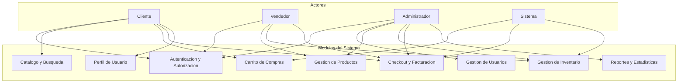

# TiendaQ -- Especificacion de Requerimientos de Software (SRS)

**Proyecto:** TiendaQ - Sistema de Comercio Electronico Universitario  
**Organizacion:** Fundacion Universitaria Konrad Lorenz (FUKL) - Club K-Forge  
**Version:** 2.0  
**Fecha:** Marzo 2026  
**Estado:** Aprobado  

---

## 1. Introduccion

### 1.1 Proposito

Este documento define la Especificacion de Requerimientos de Software (SRS) para **TiendaQ**, un sistema de comercio electronico desarrollado para la Fundacion Universitaria Konrad Lorenz. El documento establece los requerimientos funcionales y no funcionales que el sistema debe cumplir, sirviendo como contrato tecnico entre el equipo de desarrollo y los stakeholders del proyecto.

El documento esta dirigido a:

- Desarrolladores del equipo K-Forge encargados de la implementacion
- Docentes y evaluadores academicos que supervisan el proyecto
- Testers encargados de la verificacion y validacion del sistema

### 1.2 Alcance

TiendaQ es una plataforma de e-commerce completa que permite:

- A los **clientes**: registrarse, navegar un catalogo de productos, gestionar un carrito de compras, realizar compras y consultar su historial de facturacion.
- A los **empleados** (vendedores): gestionar productos, administrar inventario y procesar ventas.
- A los **administradores**: gestionar usuarios, empleados y tener visibilidad completa sobre la operacion del sistema mediante reportes.

El sistema se compone de:

- **Frontend**: Aplicacion SPA desarrollada en Angular 21 con standalone components, Angular Router y SCSS.
- **Backend**: API REST desarrollada en Spring Boot 4.0 con Java 25, Spring Security y Spring Data JPA.
- **Base de datos**: PostgreSQL 15+ como unico motor de persistencia.

**Fuera del alcance:** Integracion con pasarelas de pago reales, envio de correos electronicos transaccionales, despliegue en produccion con balanceo de carga.

### 1.3 Definiciones y acronimos

| Termino | Definicion |
| --- | --- |
| SRS | Especificacion de Requerimientos de Software (Software Requirements Specification) |
| SPA | Aplicacion de Pagina Unica (Single Page Application) |
| API REST | Interfaz de Programacion de Aplicaciones con arquitectura Representational State Transfer |
| JWT | JSON Web Token -- estandar para transmitir informacion de autenticacion de forma segura |
| CRUD | Operaciones basicas: Crear, Leer, Actualizar, Eliminar |
| DTO | Objeto de Transferencia de Datos (Data Transfer Object) |
| FK | Clave Foranea (Foreign Key) |
| PK | Clave Primaria (Primary Key) |
| IVA | Impuesto al Valor Agregado (19% en Colombia) |
| BCrypt | Algoritmo de hashing para contrasenas |
| CORS | Cross-Origin Resource Sharing -- mecanismo de seguridad para peticiones entre dominios |
| HMR | Hot Module Replacement -- recarga de modulos en desarrollo sin perder estado |
| RF | Requerimiento Funcional |
| RNF | Requerimiento No Funcional |

### 1.4 Referencias

| Referencia | Descripcion |
| --- | --- |
| DESIGN.md | Documento de diseno tecnico del sistema TiendaQ |
| SCRIPTS_POSTGRES.sql | Script de creacion del esquema de base de datos |
| Spring Boot 4.0 Documentation | Documentacion oficial del framework backend |
| Angular 21 Documentation | Documentacion oficial del framework frontend |
| IEEE 830-1998 | Estandar IEEE para especificaciones de requerimientos de software |

---

## 2. Descripcion general

### 2.1 Perspectiva del producto

TiendaQ es un sistema independiente (standalone) que no reemplaza ni se integra con ningun sistema existente. Fue concebido como un proyecto academico con nivel de complejidad profesional, orientado a que estudiantes de ingenieria de sistemas implementen un e-commerce completo de extremo a extremo.

La arquitectura del sistema sigue un modelo cliente-servidor:

```
[ Angular SPA ] --HTTP/JSON--> [ Spring Boot API ] --JDBC--> [ PostgreSQL ]
```

El frontend se comunica exclusivamente con el backend a traves de una API REST. No existen accesos directos a la base de datos desde el cliente. Toda la logica de negocio reside en la capa de servicios del backend.

### 2.2 Actores del sistema

El sistema define cuatro actores con diferentes niveles de acceso y responsabilidades:

| Actor | Descripcion | Autenticacion requerida |
| --- | --- | --- |
| **Cliente** | Usuario registrado que navega el catalogo, gestiona su carrito y realiza compras | Si |
| **Vendedor** | Empleado que gestiona productos, inventario y procesa facturas | Si |
| **Administrador** | Empleado con acceso total al sistema: gestion de usuarios, empleados, productos y reportes | Si |
| **Sistema** | Procesos automatizados: validacion de stock, calculo de IVA, transiciones de estado del carrito, alertas | No aplica |



**Jerarquia de roles:**

- Un **Administrador** hereda todas las capacidades de un **Vendedor**.
- Un **Vendedor** NO tiene acceso a gestion de usuarios ni a reportes globales.
- Un **Cliente** solo interactua con el catalogo, su carrito, su perfil y su historial.

### 2.3 Restricciones

| ID | Restriccion |
| --- | --- |
| R-01 | El backend debe desarrollarse en Java 25 con Spring Boot 4.0 |
| R-02 | El frontend debe desarrollarse en Angular 21 con TypeScript |
| R-03 | La base de datos debe ser PostgreSQL 15 o superior |
| R-04 | La comunicacion entre frontend y backend debe ser exclusivamente via API REST sobre HTTP/JSON |
| R-05 | La autenticacion debe implementarse con JWT (JSON Web Tokens) |
| R-06 | Las contrasenas deben almacenarse hasheadas con BCrypt, nunca en texto plano |
| R-07 | El sistema no requiere integracion con pasarelas de pago reales; el metodo de pago se registra pero no se procesa externamente |
| R-08 | El proyecto debe construirse con Maven (backend) y usar pnpm (dependencias) + Bun + Angular CLI (frontend) |
| R-09 | El IVA aplicado es del 19% conforme a la legislacion colombiana vigente |
| R-10 | El sistema debe funcionar en los navegadores Chrome, Firefox, Safari y Edge en sus versiones actuales |

### 2.4 Supuestos y dependencias

| ID | Supuesto / Dependencia |
| --- | --- |
| S-01 | Los usuarios disponen de una conexion a internet estable para acceder al sistema |
| S-02 | El servidor de base de datos PostgreSQL esta disponible y configurado antes del despliegue |
| S-03 | El pago se simula: el sistema registra el metodo de pago pero no realiza transacciones financieras reales |
| S-04 | Un usuario solo puede tener un carrito activo (no finalizado) a la vez |
| S-05 | Los precios de los productos no incluyen IVA; este se calcula al momento de la facturacion |
| S-06 | Las imagenes de productos se almacenan como URLs externas, no como archivos binarios en la base de datos |
| S-07 | El sistema opera en zona horaria America/Bogota (UTC-5) |
| S-08 | Spring Security y OAuth2 Client son las unicas dependencias de seguridad permitidas |

---

## 3. Requerimientos funcionales

### 3.1 Modulo de autenticacion y autorizacion

Este modulo gestiona el acceso al sistema, la emision de tokens y el control de permisos basado en roles.

---

| Campo | Detalle |
| --- | --- |
| **ID** | RF-001 |
| **Nombre** | Registro de cliente |
| **Descripcion** | El sistema debe permitir que un usuario se registre como cliente proporcionando: nombre, apellido, tipo de documento, numero de documento, telefono, correo electronico, direccion y contrasena. Al registrarse, se crea automaticamente un registro en la tabla Usuario (con tipoUsuario=REGISTRADO) y un registro asociado en la tabla Cliente. |
| **Prioridad** | Alta |
| **Actor(es)** | Usuario anonimo |
| **Precondiciones** | El correo, documento y telefono no deben estar registrados previamente en el sistema. |
| **Postcondiciones** | Se crea el usuario y el cliente asociado. El sistema retorna los datos del usuario creado (sin la contrasena). |

---

| Campo | Detalle |
| --- | --- |
| **ID** | RF-002 |
| **Nombre** | Inicio de sesion |
| **Descripcion** | El sistema debe permitir que un usuario registrado inicie sesion proporcionando su correo electronico y contrasena. El sistema valida las credenciales comparando el hash BCrypt almacenado. Si las credenciales son validas, el sistema emite un token JWT con los datos del usuario y su rol. |
| **Prioridad** | Alta |
| **Actor(es)** | Cliente, Vendedor, Administrador |
| **Precondiciones** | El usuario debe existir en el sistema con una contrasena hasheada. |
| **Postcondiciones** | Se retorna un token JWT valido con tiempo de expiracion. El token contiene el ID del usuario, correo y rol. |

---

| Campo | Detalle |
| --- | --- |
| **ID** | RF-003 |
| **Nombre** | Validacion de token JWT |
| **Descripcion** | El sistema debe validar el token JWT en cada peticion a endpoints protegidos. El token se envia en el header Authorization con el formato "Bearer {token}". Si el token es invalido, esta expirado o no esta presente, el sistema debe retornar HTTP 401 (Unauthorized). |
| **Prioridad** | Alta |
| **Actor(es)** | Sistema |
| **Precondiciones** | El endpoint solicitado requiere autenticacion. |
| **Postcondiciones** | La peticion se procesa si el token es valido; se rechaza con 401 si no lo es. |

---

| Campo | Detalle |
| --- | --- |
| **ID** | RF-004 |
| **Nombre** | Autorizacion basada en roles |
| **Descripcion** | El sistema debe restringir el acceso a endpoints segun el rol del usuario autenticado. Los roles son: CLIENTE (acceso a catalogo, carrito, perfil, historial), VENDEDOR (acceso a productos, stock, facturas), ADMINISTRADOR (acceso total incluyendo gestion de usuarios y reportes). Un usuario con rol superior hereda los permisos del rol inferior. |
| **Prioridad** | Alta |
| **Actor(es)** | Sistema |
| **Precondiciones** | El usuario esta autenticado con un token JWT valido que contiene su rol. |
| **Postcondiciones** | Se permite o deniega (HTTP 403 Forbidden) el acceso segun la matriz de permisos. |

---

| Campo | Detalle |
| --- | --- |
| **ID** | RF-005 |
| **Nombre** | Cierre de sesion |
| **Descripcion** | El sistema debe permitir al usuario cerrar su sesion. Al cerrar sesion, el token JWT actual debe invalidarse (ya sea mediante blacklist en el servidor o eliminacion en el cliente). Las peticiones posteriores con el token invalidado deben ser rechazadas. |
| **Prioridad** | Media |
| **Actor(es)** | Cliente, Vendedor, Administrador |
| **Precondiciones** | El usuario tiene una sesion activa con un token JWT valido. |
| **Postcondiciones** | El token queda invalidado. Las peticiones posteriores con dicho token retornan HTTP 401. |

---

| Campo | Detalle |
| --- | --- |
| **ID** | RF-006 |
| **Nombre** | Recuperacion de contrasena |
| **Descripcion** | El sistema debe permitir que un usuario solicite la recuperacion de su contrasena proporcionando su correo electronico. El sistema genera un token temporal de recuperacion y simula el envio de un enlace de restablecimiento (log en consola o endpoint dedicado). El usuario puede establecer una nueva contrasena usando el token temporal. |
| **Prioridad** | Media |
| **Actor(es)** | Cliente, Vendedor, Administrador |
| **Precondiciones** | El correo proporcionado debe estar registrado en el sistema. |
| **Postcondiciones** | Se genera un token temporal. El usuario puede usarlo para establecer una nueva contrasena hasheada con BCrypt. |

---

| Campo | Detalle |
| --- | --- |
| **ID** | RF-007 |
| **Nombre** | Renovacion de token JWT |
| **Descripcion** | El sistema debe permitir la renovacion de un token JWT antes de que expire. El usuario envia su token actual (aun valido) y recibe un nuevo token con un tiempo de expiracion extendido. Tokens expirados no pueden renovarse. |
| **Prioridad** | Baja |
| **Actor(es)** | Cliente, Vendedor, Administrador |
| **Precondiciones** | El token actual debe ser valido y no haber expirado. |
| **Postcondiciones** | Se emite un nuevo token JWT; el token anterior se invalida. |

---

### 3.2 Modulo de gestion de productos

Este modulo permite a los empleados crear, consultar, actualizar y eliminar productos del catalogo.

---

| Campo | Detalle |
| --- | --- |
| **ID** | RF-008 |
| **Nombre** | Crear producto |
| **Descripcion** | El sistema debe permitir a un empleado (Vendedor o Administrador) crear un nuevo producto proporcionando: nombre del producto, categoria (ROPA, ACCESORIOS, LIBRERIA, PAPELERIA), precio unitario y opcionalmente una URL de imagen. El nombre del producto debe ser unico dentro de la misma categoria. El precio debe ser un valor numerico positivo con hasta 2 decimales. |
| **Prioridad** | Alta |
| **Actor(es)** | Vendedor, Administrador |
| **Precondiciones** | El usuario esta autenticado con rol VENDEDOR o ADMINISTRADOR. No existe otro producto con el mismo nombre en la misma categoria. |
| **Postcondiciones** | Se crea el producto en la base de datos con stock inicial en 0. Se retorna el producto creado con su ID asignado. |

---

| Campo | Detalle |
| --- | --- |
| **ID** | RF-009 |
| **Nombre** | Consultar producto por ID |
| **Descripcion** | El sistema debe permitir consultar los datos completos de un producto a partir de su ID, incluyendo su informacion de stock actual. Si el producto no existe, se retorna HTTP 404. |
| **Prioridad** | Alta |
| **Actor(es)** | Cliente, Vendedor, Administrador |
| **Precondiciones** | Ninguna (endpoint publico para consulta basica). |
| **Postcondiciones** | Se retorna el producto con sus datos completos o HTTP 404 si no existe. |

---

| Campo | Detalle |
| --- | --- |
| **ID** | RF-010 |
| **Nombre** | Listar todos los productos |
| **Descripcion** | El sistema debe permitir listar todos los productos registrados. La respuesta debe soportar paginacion (parametros: page, size) y ordenamiento (parametros: sortBy, direction). Por defecto, se retorna la primera pagina con 20 elementos ordenados por nombre ascendente. |
| **Prioridad** | Alta |
| **Actor(es)** | Cliente, Vendedor, Administrador |
| **Precondiciones** | Ninguna. |
| **Postcondiciones** | Se retorna la lista paginada de productos con metadatos de paginacion (totalElements, totalPages, currentPage). |

---

| Campo | Detalle |
| --- | --- |
| **ID** | RF-011 |
| **Nombre** | Actualizar producto |
| **Descripcion** | El sistema debe permitir a un empleado actualizar los datos de un producto existente: nombre, categoria, precio unitario e imagen. La validacion de unicidad de nombre por categoria se mantiene. Si el producto no existe, se retorna HTTP 404. |
| **Prioridad** | Alta |
| **Actor(es)** | Vendedor, Administrador |
| **Precondiciones** | El usuario esta autenticado con rol VENDEDOR o ADMINISTRADOR. El producto existe en el sistema. |
| **Postcondiciones** | Se actualizan los campos del producto. Se retorna el producto actualizado. |

---

| Campo | Detalle |
| --- | --- |
| **ID** | RF-012 |
| **Nombre** | Eliminar producto |
| **Descripcion** | El sistema debe permitir a un empleado eliminar un producto. Un producto solo puede eliminarse si no tiene stock registrado y no esta referenciado en ningun item de carrito activo ni en detalle de factura. Si no se puede eliminar por dependencias, se retorna HTTP 409 (Conflict) con un mensaje descriptivo. |
| **Prioridad** | Alta |
| **Actor(es)** | Vendedor, Administrador |
| **Precondiciones** | El usuario esta autenticado con rol VENDEDOR o ADMINISTRADOR. El producto existe. El producto no tiene dependencias activas. |
| **Postcondiciones** | Se elimina el producto y sus registros de stock asociados. Se retorna HTTP 204 (No Content). |

---

| Campo | Detalle |
| --- | --- |
| **ID** | RF-013 |
| **Nombre** | Filtrar productos por categoria |
| **Descripcion** | El sistema debe permitir listar productos filtrados por su categoria (ROPA, ACCESORIOS, LIBRERIA, PAPELERIA). La respuesta debe soportar paginacion y ordenamiento. Si la categoria no es valida, se retorna HTTP 400 (Bad Request). |
| **Prioridad** | Alta |
| **Actor(es)** | Cliente, Vendedor, Administrador |
| **Precondiciones** | La categoria proporcionada es un valor valido del enum. |
| **Postcondiciones** | Se retorna la lista paginada de productos pertenecientes a la categoria indicada. |

---

### 3.3 Modulo de catalogo y busqueda

Este modulo provee las funcionalidades de exploracion y busqueda de productos para el cliente final.

---

| Campo | Detalle |
| --- | --- |
| **ID** | RF-014 |
| **Nombre** | Buscar productos por nombre |
| **Descripcion** | El sistema debe permitir buscar productos cuyo nombre contenga un texto parcial proporcionado por el usuario (busqueda tipo LIKE/ILIKE, case-insensitive). La respuesta debe soportar paginacion. Si no se encuentran resultados, se retorna una lista vacia (no un error). |
| **Prioridad** | Alta |
| **Actor(es)** | Cliente, Vendedor, Administrador |
| **Precondiciones** | El parametro de busqueda tiene al menos 2 caracteres. |
| **Postcondiciones** | Se retorna la lista paginada de productos cuyo nombre coincide con el criterio de busqueda. |

---

| Campo | Detalle |
| --- | --- |
| **ID** | RF-015 |
| **Nombre** | Filtrar productos por rango de precio |
| **Descripcion** | El sistema debe permitir filtrar productos cuyo precio unitario este dentro de un rango especificado (parametros: precioMin, precioMax). Ambos parametros son opcionales: si solo se proporciona precioMin, se filtran productos con precio >= precioMin; si solo se proporciona precioMax, se filtran con precio <= precioMax. |
| **Prioridad** | Media |
| **Actor(es)** | Cliente, Vendedor, Administrador |
| **Precondiciones** | Si se proporcionan ambos parametros, precioMin debe ser menor o igual que precioMax. Los valores deben ser numericos positivos. |
| **Postcondiciones** | Se retorna la lista paginada de productos dentro del rango de precio indicado. |

---

| Campo | Detalle |
| --- | --- |
| **ID** | RF-016 |
| **Nombre** | Busqueda combinada con multiples filtros |
| **Descripcion** | El sistema debe permitir combinar los filtros de busqueda: nombre (parcial), categoria, rango de precio y disponibilidad de stock (en stock / sin stock). Los filtros se aplican de manera conjuntiva (AND). El resultado debe soportar paginacion y ordenamiento por nombre, precio o categoria. |
| **Prioridad** | Media |
| **Actor(es)** | Cliente, Vendedor, Administrador |
| **Precondiciones** | Al menos un filtro debe estar presente en la solicitud. |
| **Postcondiciones** | Se retorna la lista paginada de productos que cumplen con todos los filtros aplicados. |

---

| Campo | Detalle |
| --- | --- |
| **ID** | RF-017 |
| **Nombre** | Ver detalle de producto en catalogo |
| **Descripcion** | El sistema debe permitir al cliente ver el detalle completo de un producto: nombre, categoria, precio unitario, imagen (si existe) y disponibilidad de stock (cantidad disponible). Si el stock es 0, el producto se muestra como "Agotado". |
| **Prioridad** | Alta |
| **Actor(es)** | Cliente |
| **Precondiciones** | El producto existe en el sistema. |
| **Postcondiciones** | Se retorna la informacion completa del producto incluyendo su disponibilidad actual. |

---

### 3.4 Modulo de carrito de compras

Este modulo gestiona el ciclo de vida del carrito de compras de un cliente.

---

| Campo | Detalle |
| --- | --- |
| **ID** | RF-018 |
| **Nombre** | Crear carrito de compras |
| **Descripcion** | El sistema debe crear automaticamente un carrito de compras para un usuario cuando este agrega su primer producto y no tiene un carrito activo. El carrito se crea con estado VACIO y fecha de creacion actual. Un usuario solo puede tener un carrito en estado no finalizado (diferente a PAGO_EXITOSO) a la vez. |
| **Prioridad** | Alta |
| **Actor(es)** | Sistema |
| **Precondiciones** | El usuario esta autenticado. No existe un carrito activo para el usuario. |
| **Postcondiciones** | Se crea un nuevo carrito con estado VACIO asociado al usuario. |

---

| Campo | Detalle |
| --- | --- |
| **ID** | RF-019 |
| **Nombre** | Agregar producto al carrito |
| **Descripcion** | El sistema debe permitir al cliente agregar un producto a su carrito activo especificando el ID del producto y la cantidad deseada. El sistema debe validar que: (a) el producto existe, (b) hay stock suficiente para la cantidad solicitada, (c) si el producto ya esta en el carrito, se suma la cantidad. El precio unitario se registra al momento de agregar el item. El estado del carrito cambia a CON_PRODUCTOS. |
| **Prioridad** | Alta |
| **Actor(es)** | Cliente |
| **Precondiciones** | El cliente esta autenticado. El producto existe y tiene stock suficiente. La cantidad es un entero positivo. |
| **Postcondiciones** | Se agrega el item al carrito (o se actualiza la cantidad si ya existia). El estado del carrito es CON_PRODUCTOS. |

---

| Campo | Detalle |
| --- | --- |
| **ID** | RF-020 |
| **Nombre** | Modificar cantidad de item en carrito |
| **Descripcion** | El sistema debe permitir al cliente modificar la cantidad de un producto en su carrito. La nueva cantidad debe ser un entero positivo. El sistema valida que haya stock suficiente para la nueva cantidad. Si la cantidad se establece en 0, el item se elimina del carrito. |
| **Prioridad** | Alta |
| **Actor(es)** | Cliente |
| **Precondiciones** | El cliente esta autenticado. El item existe en el carrito activo. Stock suficiente para la nueva cantidad. |
| **Postcondiciones** | Se actualiza la cantidad del item. Si la cantidad es 0, se elimina el item. Si el carrito queda sin items, su estado cambia a VACIO. |

---

| Campo | Detalle |
| --- | --- |
| **ID** | RF-021 |
| **Nombre** | Eliminar item del carrito |
| **Descripcion** | El sistema debe permitir al cliente eliminar un producto especifico de su carrito activo. Si el carrito queda sin items despues de la eliminacion, su estado cambia a VACIO. |
| **Prioridad** | Alta |
| **Actor(es)** | Cliente |
| **Precondiciones** | El cliente esta autenticado. El item existe en el carrito activo. |
| **Postcondiciones** | Se elimina el item del carrito. Si no quedan items, el estado del carrito cambia a VACIO. |

---

| Campo | Detalle |
| --- | --- |
| **ID** | RF-022 |
| **Nombre** | Vaciar carrito completo |
| **Descripcion** | El sistema debe permitir al cliente eliminar todos los items de su carrito activo en una sola operacion. El estado del carrito cambia a VACIO. |
| **Prioridad** | Media |
| **Actor(es)** | Cliente |
| **Precondiciones** | El cliente esta autenticado. Tiene un carrito activo con al menos un item. |
| **Postcondiciones** | Se eliminan todos los items del carrito. El estado del carrito es VACIO. |

---

| Campo | Detalle |
| --- | --- |
| **ID** | RF-023 |
| **Nombre** | Consultar carrito activo |
| **Descripcion** | El sistema debe permitir al cliente consultar su carrito activo, incluyendo: lista de items (producto, cantidad, precio unitario, subtotal por item), subtotal general, IVA calculado (19%) y total con IVA. Si el cliente no tiene carrito activo, se retorna un carrito vacio. |
| **Prioridad** | Alta |
| **Actor(es)** | Cliente |
| **Precondiciones** | El cliente esta autenticado. |
| **Postcondiciones** | Se retorna el carrito con todos los calculos actualizados. |

---

| Campo | Detalle |
| --- | --- |
| **ID** | RF-024 |
| **Nombre** | Validacion de stock en tiempo real |
| **Descripcion** | El sistema debe validar la disponibilidad de stock cada vez que se agrega o modifica un item en el carrito. Si el stock disponible es insuficiente, la operacion se rechaza con HTTP 409 (Conflict) indicando el stock disponible actual del producto. |
| **Prioridad** | Alta |
| **Actor(es)** | Sistema |
| **Precondiciones** | Se intenta agregar o modificar un item en el carrito. |
| **Postcondiciones** | La operacion se completa si hay stock suficiente; se rechaza con mensaje informativo si no lo hay. |

---

| Campo | Detalle |
| --- | --- |
| **ID** | RF-025 |
| **Nombre** | Transiciones de estado del carrito |
| **Descripcion** | El carrito debe seguir una maquina de estados con las siguientes transiciones validas: VACIO -> CON_PRODUCTOS (al agregar items), CON_PRODUCTOS -> VACIO (al vaciar), CON_PRODUCTOS -> EN_PROCESO_DE_PAGO (al iniciar checkout), EN_PROCESO_DE_PAGO -> PAGO_PENDIENTE (al confirmar datos de pago), PAGO_PENDIENTE -> PAGO_EXITOSO (al procesar pago), EN_PROCESO_DE_PAGO -> CON_PRODUCTOS (al cancelar checkout). Cualquier transicion no definida debe rechazarse con HTTP 400. |
| **Prioridad** | Alta |
| **Actor(es)** | Sistema |
| **Precondiciones** | El carrito existe y tiene un estado valido. |
| **Postcondiciones** | El carrito transiciona al nuevo estado si la transicion es valida; se rechaza la operacion si no lo es. |

---

### 3.5 Modulo de checkout y facturacion

Este modulo gestiona el proceso de finalizacion de compra y la generacion de facturas.

---

| Campo | Detalle |
| --- | --- |
| **ID** | RF-026 |
| **Nombre** | Iniciar proceso de checkout |
| **Descripcion** | El sistema debe permitir al cliente iniciar el proceso de checkout de su carrito activo. Al iniciar, el sistema: (a) valida que el carrito tiene al menos un item, (b) re-valida el stock de todos los productos en el carrito, (c) cambia el estado del carrito a EN_PROCESO_DE_PAGO. Si algun producto no tiene stock suficiente, se retorna HTTP 409 con el detalle de los productos con stock insuficiente. |
| **Prioridad** | Alta |
| **Actor(es)** | Cliente |
| **Precondiciones** | El cliente esta autenticado. El carrito tiene estado CON_PRODUCTOS con al menos un item. |
| **Postcondiciones** | El estado del carrito cambia a EN_PROCESO_DE_PAGO. Los precios se congelan. |

---

| Campo | Detalle |
| --- | --- |
| **ID** | RF-027 |
| **Nombre** | Confirmar metodo de pago |
| **Descripcion** | El sistema debe permitir al cliente seleccionar un metodo de pago para su compra. Los metodos disponibles son: PSE, TARJETA_CREDITO, TARJETA_DEBITO, EFECTIVO, TRANSFERENCIA. El estado del carrito cambia a PAGO_PENDIENTE. No se realiza procesamiento real de pago. |
| **Prioridad** | Alta |
| **Actor(es)** | Cliente |
| **Precondiciones** | El carrito tiene estado EN_PROCESO_DE_PAGO. El metodo de pago es un valor valido del enum. |
| **Postcondiciones** | El estado del carrito cambia a PAGO_PENDIENTE. El metodo de pago queda registrado para la facturacion. |

---

| Campo | Detalle |
| --- | --- |
| **ID** | RF-028 |
| **Nombre** | Generar factura |
| **Descripcion** | El sistema debe generar una factura al completar el proceso de pago. La factura debe contener: fecha de compra, subtotal (suma de items), IVA (19% del subtotal), total (subtotal + IVA), metodo de pago, referencia al cliente, referencia al empleado que procesa (puede ser el sistema) y referencia al carrito. Ademas, se deben crear los registros de DetalleFactura con el snapshot del precio unitario y cantidad de cada producto al momento de la compra. |
| **Prioridad** | Alta |
| **Actor(es)** | Sistema |
| **Precondiciones** | El carrito tiene estado PAGO_PENDIENTE con un metodo de pago seleccionado. |
| **Postcondiciones** | Se crea la factura con sus detalles. El estado del carrito cambia a PAGO_EXITOSO. Se descuenta el stock de cada producto vendido. Se retorna la factura generada con su numero. |

---

| Campo | Detalle |
| --- | --- |
| **ID** | RF-029 |
| **Nombre** | Cancelar proceso de checkout |
| **Descripcion** | El sistema debe permitir al cliente cancelar el proceso de checkout mientras el carrito este en estado EN_PROCESO_DE_PAGO. Al cancelar, el estado del carrito regresa a CON_PRODUCTOS y los items permanecen intactos. No se puede cancelar si el estado ya es PAGO_PENDIENTE o PAGO_EXITOSO. |
| **Prioridad** | Media |
| **Actor(es)** | Cliente |
| **Precondiciones** | El carrito tiene estado EN_PROCESO_DE_PAGO. |
| **Postcondiciones** | El estado del carrito regresa a CON_PRODUCTOS. |

---

| Campo | Detalle |
| --- | --- |
| **ID** | RF-030 |
| **Nombre** | Consultar historial de facturas del cliente |
| **Descripcion** | El sistema debe permitir al cliente consultar su historial de facturas. La lista debe estar paginada y ordenada por fecha de compra descendente (mas reciente primero). Cada factura en la lista muestra: numero de factura, fecha, total y metodo de pago. |
| **Prioridad** | Alta |
| **Actor(es)** | Cliente |
| **Precondiciones** | El cliente esta autenticado. |
| **Postcondiciones** | Se retorna la lista paginada de facturas del cliente. |

---

| Campo | Detalle |
| --- | --- |
| **ID** | RF-031 |
| **Nombre** | Consultar detalle de factura |
| **Descripcion** | El sistema debe permitir consultar el detalle completo de una factura: datos generales (fecha, subtotal, IVA, total, metodo de pago), datos del cliente (nombre, documento), datos del empleado que proceso y lista de productos comprados (nombre, cantidad, precio unitario, subtotal por linea). Un cliente solo puede ver sus propias facturas; un empleado o administrador puede ver cualquiera. |
| **Prioridad** | Alta |
| **Actor(es)** | Cliente, Vendedor, Administrador |
| **Precondiciones** | El usuario esta autenticado. La factura existe. El cliente solo accede a sus propias facturas. |
| **Postcondiciones** | Se retorna el detalle completo de la factura. |

---

| Campo | Detalle |
| --- | --- |
| **ID** | RF-032 |
| **Nombre** | Descontar stock al facturar |
| **Descripcion** | Al generar una factura, el sistema debe descontar automaticamente la cantidad vendida del stock de cada producto. La operacion debe ser atomica: si el descuento de cualquier producto falla (por stock insuficiente en el momento de la transaccion), se debe revertir toda la operacion (rollback) y retornar HTTP 409. |
| **Prioridad** | Alta |
| **Actor(es)** | Sistema |
| **Precondiciones** | Se esta procesando la generacion de una factura. |
| **Postcondiciones** | El stock de cada producto se reduce en la cantidad vendida. La operacion es transaccional. |

---

| Campo | Detalle |
| --- | --- |
| **ID** | RF-033 |
| **Nombre** | Listar todas las facturas (empleados) |
| **Descripcion** | El sistema debe permitir a empleados y administradores consultar todas las facturas del sistema con filtros opcionales: rango de fechas (fechaDesde, fechaHasta), metodo de pago y ID de cliente. La respuesta debe estar paginada y ordenada por fecha descendente. |
| **Prioridad** | Media |
| **Actor(es)** | Vendedor, Administrador |
| **Precondiciones** | El usuario esta autenticado con rol VENDEDOR o ADMINISTRADOR. |
| **Postcondiciones** | Se retorna la lista paginada de facturas que cumplen los filtros. |

---

### 3.6 Modulo de gestion de inventario (stock)

Este modulo gestiona el control de existencias de los productos.

---

| Campo | Detalle |
| --- | --- |
| **ID** | RF-034 |
| **Nombre** | Registrar ingreso de stock |
| **Descripcion** | El sistema debe permitir a un empleado registrar un ingreso de stock para un producto. Se debe especificar el ID del producto y la cantidad ingresada (entero positivo). El sistema crea un nuevo registro de stock con la fecha de ingreso actual. Si el producto no existe, se retorna HTTP 404. |
| **Prioridad** | Alta |
| **Actor(es)** | Vendedor, Administrador |
| **Precondiciones** | El usuario esta autenticado con rol VENDEDOR o ADMINISTRADOR. El producto existe. La cantidad es un entero positivo. |
| **Postcondiciones** | Se crea un registro de stock. El stock total disponible del producto se incrementa. |

---

| Campo | Detalle |
| --- | --- |
| **ID** | RF-035 |
| **Nombre** | Consultar stock de un producto |
| **Descripcion** | El sistema debe permitir consultar el stock actual de un producto especifico. Se retorna la sumatoria de todos los registros de stock menos las cantidades vendidas (reflejadas en facturas). Ademas, se incluye el historial de ingresos de stock (fecha y cantidad de cada ingreso). |
| **Prioridad** | Alta |
| **Actor(es)** | Vendedor, Administrador |
| **Precondiciones** | El producto existe. |
| **Postcondiciones** | Se retorna el stock disponible actual y el historial de ingresos. |

---

| Campo | Detalle |
| --- | --- |
| **ID** | RF-036 |
| **Nombre** | Listar inventario general |
| **Descripcion** | El sistema debe permitir a los empleados consultar el inventario completo: lista de todos los productos con su stock actual. La respuesta debe soportar paginacion, ordenamiento (por nombre, stock, categoria) y filtro por categoria. Se debe indicar cuales productos tienen stock bajo (ver RF-037). |
| **Prioridad** | Alta |
| **Actor(es)** | Vendedor, Administrador |
| **Precondiciones** | El usuario esta autenticado con rol VENDEDOR o ADMINISTRADOR. |
| **Postcondiciones** | Se retorna la lista paginada de productos con su informacion de stock. |

---

| Campo | Detalle |
| --- | --- |
| **ID** | RF-037 |
| **Nombre** | Alerta de stock bajo |
| **Descripcion** | El sistema debe identificar productos cuyo stock disponible sea menor o igual a un umbral configurable (por defecto: 5 unidades). Estos productos deben marcarse con una bandera de "stock bajo" en las consultas de inventario. Ademas, debe existir un endpoint dedicado que retorne exclusivamente los productos con stock bajo. |
| **Prioridad** | Media |
| **Actor(es)** | Sistema, Vendedor, Administrador |
| **Precondiciones** | Ninguna. |
| **Postcondiciones** | Se retorna la lista de productos con stock bajo el umbral definido. |

---

| Campo | Detalle |
| --- | --- |
| **ID** | RF-038 |
| **Nombre** | Actualizar registro de stock |
| **Descripcion** | El sistema debe permitir a un administrador corregir un registro de stock existente (por ejemplo, en caso de error de ingreso). Se debe registrar la cantidad anterior y la nueva cantidad para auditoria. Solo el rol ADMINISTRADOR puede realizar esta operacion. |
| **Prioridad** | Baja |
| **Actor(es)** | Administrador |
| **Precondiciones** | El usuario esta autenticado con rol ADMINISTRADOR. El registro de stock existe. |
| **Postcondiciones** | Se actualiza la cantidad del registro. Se mantiene trazabilidad del cambio. |

---

### 3.7 Modulo de gestion de usuarios

Este modulo permite al administrador gestionar las cuentas de usuarios y empleados del sistema.

---

| Campo | Detalle |
| --- | --- |
| **ID** | RF-039 |
| **Nombre** | Listar usuarios |
| **Descripcion** | El sistema debe permitir al administrador consultar la lista de todos los usuarios del sistema. La respuesta debe soportar paginacion, ordenamiento (por nombre, apellido, correo) y filtros por tipo de usuario (REGISTRADO, SIN_REGISTRAR) y por tipo de documento. Las contrasenas nunca deben incluirse en la respuesta. |
| **Prioridad** | Alta |
| **Actor(es)** | Administrador |
| **Precondiciones** | El usuario esta autenticado con rol ADMINISTRADOR. |
| **Postcondiciones** | Se retorna la lista paginada de usuarios sin datos sensibles. |

---

| Campo | Detalle |
| --- | --- |
| **ID** | RF-040 |
| **Nombre** | Consultar usuario por ID |
| **Descripcion** | El sistema debe permitir al administrador consultar los datos completos de un usuario (excluyendo contrasena), incluyendo su rol asociado (cliente, vendedor o administrador) y el estado de su cuenta. Si el usuario no existe, se retorna HTTP 404. |
| **Prioridad** | Alta |
| **Actor(es)** | Administrador |
| **Precondiciones** | El usuario esta autenticado con rol ADMINISTRADOR. |
| **Postcondiciones** | Se retorna la informacion del usuario sin la contrasena. |

---

| Campo | Detalle |
| --- | --- |
| **ID** | RF-041 |
| **Nombre** | Crear usuario con rol de empleado |
| **Descripcion** | El sistema debe permitir al administrador crear un nuevo usuario y asignarle un rol de empleado (VENDEDOR o ADMINISTRADOR). Se deben proporcionar todos los datos del usuario (nombre, apellido, tipo de documento, documento, telefono, correo, direccion, contrasena) y el tipo de empleado. El sistema crea el usuario y el empleado asociado en una sola transaccion. |
| **Prioridad** | Alta |
| **Actor(es)** | Administrador |
| **Precondiciones** | El usuario esta autenticado con rol ADMINISTRADOR. El correo, documento y telefono son unicos. |
| **Postcondiciones** | Se crea el usuario y el empleado en una transaccion atomica. |

---

| Campo | Detalle |
| --- | --- |
| **ID** | RF-042 |
| **Nombre** | Actualizar datos de usuario |
| **Descripcion** | El sistema debe permitir al administrador actualizar los datos de cualquier usuario: nombre, apellido, telefono, direccion, correo. No se permite modificar el tipo de documento ni el numero de documento. Si se cambia el correo, se valida unicidad. La contrasena solo se actualiza si se proporciona explicitamente un nuevo valor (no se sobreescribe con null). |
| **Prioridad** | Alta |
| **Actor(es)** | Administrador |
| **Precondiciones** | El usuario esta autenticado con rol ADMINISTRADOR. El usuario objetivo existe. |
| **Postcondiciones** | Se actualizan los campos proporcionados. Los campos no proporcionados permanecen inalterados. |

---

| Campo | Detalle |
| --- | --- |
| **ID** | RF-043 |
| **Nombre** | Eliminar usuario |
| **Descripcion** | El sistema debe permitir al administrador eliminar un usuario. La eliminacion debe ser logica (soft delete) o debe validar que el usuario no tenga facturas asociadas. Si el usuario tiene facturas, no puede eliminarse y se retorna HTTP 409 con un mensaje explicativo. Al eliminar un usuario, se eliminan sus registros asociados (cliente o empleado) y sus carritos no finalizados. |
| **Prioridad** | Media |
| **Actor(es)** | Administrador |
| **Precondiciones** | El usuario esta autenticado con rol ADMINISTRADOR. El usuario objetivo existe. El usuario no tiene facturas asociadas (o se aplica soft delete). |
| **Postcondiciones** | El usuario y sus registros dependientes se eliminan o desactivan. |

---

| Campo | Detalle |
| --- | --- |
| **ID** | RF-044 |
| **Nombre** | Cambiar rol de empleado |
| **Descripcion** | El sistema debe permitir al administrador cambiar el tipo de empleado (de VENDEDOR a ADMINISTRADOR o viceversa). No se permite asignar rol de empleado a un usuario que ya es cliente sin antes crear el registro de empleado correspondiente. |
| **Prioridad** | Media |
| **Actor(es)** | Administrador |
| **Precondiciones** | El usuario esta autenticado con rol ADMINISTRADOR. El empleado existe. |
| **Postcondiciones** | Se actualiza el tipo de empleado. |

---

| Campo | Detalle |
| --- | --- |
| **ID** | RF-045 |
| **Nombre** | Buscar usuarios por documento o correo |
| **Descripcion** | El sistema debe permitir al administrador buscar usuarios por su numero de documento (busqueda exacta) o por correo electronico (busqueda parcial, case-insensitive). Si no se encuentran resultados, se retorna una lista vacia. |
| **Prioridad** | Media |
| **Actor(es)** | Administrador |
| **Precondiciones** | El usuario esta autenticado con rol ADMINISTRADOR. |
| **Postcondiciones** | Se retorna la lista de usuarios que coinciden con el criterio de busqueda. |

---

### 3.8 Modulo de perfil de usuario

Este modulo permite a los usuarios gestionar su propia informacion personal.

---

| Campo | Detalle |
| --- | --- |
| **ID** | RF-046 |
| **Nombre** | Consultar perfil propio |
| **Descripcion** | El sistema debe permitir al usuario autenticado consultar sus propios datos de perfil: nombre, apellido, tipo de documento, documento, telefono, correo, direccion y tipo de usuario. La contrasena no se incluye en la respuesta. |
| **Prioridad** | Alta |
| **Actor(es)** | Cliente, Vendedor, Administrador |
| **Precondiciones** | El usuario esta autenticado. |
| **Postcondiciones** | Se retornan los datos del perfil del usuario autenticado. |

---

| Campo | Detalle |
| --- | --- |
| **ID** | RF-047 |
| **Nombre** | Actualizar perfil propio |
| **Descripcion** | El sistema debe permitir al usuario autenticado actualizar su propia informacion: telefono, direccion. No se permite modificar nombre, apellido, tipo de documento ni documento desde este endpoint. Si se desea cambiar el correo, se requiere verificar la contrasena actual. |
| **Prioridad** | Media |
| **Actor(es)** | Cliente, Vendedor, Administrador |
| **Precondiciones** | El usuario esta autenticado. Si cambia el correo, proporciona la contrasena actual. |
| **Postcondiciones** | Se actualizan los campos permitidos del perfil. |

---

| Campo | Detalle |
| --- | --- |
| **ID** | RF-048 |
| **Nombre** | Cambiar contrasena |
| **Descripcion** | El sistema debe permitir al usuario autenticado cambiar su contrasena. Debe proporcionar la contrasena actual (para verificacion) y la nueva contrasena. La nueva contrasena debe cumplir requisitos minimos: al menos 8 caracteres, al menos una letra mayuscula, al menos un numero. La nueva contrasena se almacena hasheada con BCrypt. |
| **Prioridad** | Media |
| **Actor(es)** | Cliente, Vendedor, Administrador |
| **Precondiciones** | El usuario esta autenticado. La contrasena actual proporcionada coincide con la almacenada. La nueva contrasena cumple los requisitos de complejidad. |
| **Postcondiciones** | Se actualiza la contrasena hasheada del usuario. |

---

### 3.9 Modulo de reportes y estadisticas

Este modulo provee informacion agregada y estadisticas de negocio para los administradores.

---

| Campo | Detalle |
| --- | --- |
| **ID** | RF-049 |
| **Nombre** | Reporte de ventas por periodo |
| **Descripcion** | El sistema debe generar un reporte de ventas para un rango de fechas especificado. El reporte debe incluir: numero total de ventas, monto total vendido (sin IVA), monto total de IVA recaudado, monto total con IVA, promedio de venta por factura y lista de facturas del periodo. |
| **Prioridad** | Media |
| **Actor(es)** | Administrador |
| **Precondiciones** | El usuario esta autenticado con rol ADMINISTRADOR. Se proporcionan fechaDesde y fechaHasta validas. |
| **Postcondiciones** | Se retorna el reporte con los datos agregados del periodo solicitado. |

---

| Campo | Detalle |
| --- | --- |
| **ID** | RF-050 |
| **Nombre** | Productos mas vendidos |
| **Descripcion** | El sistema debe generar un ranking de los productos mas vendidos en un periodo determinado. Cada entrada del ranking incluye: nombre del producto, categoria, cantidad total vendida y monto total generado. El ranking debe soportar un parametro de limite (por defecto: top 10). |
| **Prioridad** | Media |
| **Actor(es)** | Administrador |
| **Precondiciones** | El usuario esta autenticado con rol ADMINISTRADOR. |
| **Postcondiciones** | Se retorna la lista ordenada de productos mas vendidos con sus metricas. |

---

| Campo | Detalle |
| --- | --- |
| **ID** | RF-051 |
| **Nombre** | Resumen de inventario |
| **Descripcion** | El sistema debe generar un resumen del estado del inventario: total de productos registrados, productos con stock mayor a 0, productos agotados (stock = 0), productos con stock bajo (segun umbral), valor total del inventario (sumatoria de stock * precio unitario por producto). |
| **Prioridad** | Media |
| **Actor(es)** | Administrador |
| **Precondiciones** | El usuario esta autenticado con rol ADMINISTRADOR. |
| **Postcondiciones** | Se retorna el resumen estadistico del inventario. |

---

| Campo | Detalle |
| --- | --- |
| **ID** | RF-052 |
| **Nombre** | Ventas por categoria |
| **Descripcion** | El sistema debe generar un reporte de ventas agrupado por categoria de producto. Para cada categoria, se muestra: cantidad de productos vendidos, monto total vendido y porcentaje del total de ventas. El reporte puede filtrarse por rango de fechas. |
| **Prioridad** | Baja |
| **Actor(es)** | Administrador |
| **Precondiciones** | El usuario esta autenticado con rol ADMINISTRADOR. |
| **Postcondiciones** | Se retorna el reporte de ventas desglosado por categoria. |

---

| Campo | Detalle |
| --- | --- |
| **ID** | RF-053 |
| **Nombre** | Ventas por empleado |
| **Descripcion** | El sistema debe generar un reporte de ventas agrupado por el empleado que proceso la factura. Para cada empleado, se muestra: nombre completo, cantidad de facturas procesadas, monto total vendido y promedio por factura. El reporte puede filtrarse por rango de fechas. |
| **Prioridad** | Baja |
| **Actor(es)** | Administrador |
| **Precondiciones** | El usuario esta autenticado con rol ADMINISTRADOR. |
| **Postcondiciones** | Se retorna el reporte de ventas agrupado por empleado. |

---

| Campo | Detalle |
| --- | --- |
| **ID** | RF-054 |
| **Nombre** | Dashboard de indicadores clave |
| **Descripcion** | El sistema debe proveer un endpoint que retorne indicadores clave (KPIs) del negocio: ventas del dia, ventas de la semana, ventas del mes, cantidad de clientes registrados, cantidad de productos activos, cantidad de productos agotados y valor del inventario total. |
| **Prioridad** | Baja |
| **Actor(es)** | Administrador |
| **Precondiciones** | El usuario esta autenticado con rol ADMINISTRADOR. |
| **Postcondiciones** | Se retorna un objeto JSON con todos los KPIs calculados. |

---

### 3.10 Modulo de validacion y manejo de errores

Este modulo define las reglas transversales de validacion de datos y manejo de errores del sistema.

---

| Campo | Detalle |
| --- | --- |
| **ID** | RF-055 |
| **Nombre** | Validacion de campos obligatorios |
| **Descripcion** | El sistema debe validar que todos los campos marcados como NOT NULL en la base de datos sean proporcionados en las solicitudes de creacion y actualizacion. Si faltan campos obligatorios, se retorna HTTP 400 con un objeto de error que lista cada campo faltante y su mensaje de validacion. |
| **Prioridad** | Alta |
| **Actor(es)** | Sistema |
| **Precondiciones** | Se recibe una solicitud de creacion o actualizacion. |
| **Postcondiciones** | La solicitud se procesa si es valida; se rechaza con mensajes descriptivos si no lo es. |

---

| Campo | Detalle |
| --- | --- |
| **ID** | RF-056 |
| **Nombre** | Validacion de formatos |
| **Descripcion** | El sistema debe validar los formatos de los campos: correo electronico (formato valido de email), telefono (solo digitos, entre 7 y 15 caracteres), documento (solo alfanumerico, entre 5 y 20 caracteres), precio (numerico positivo con hasta 2 decimales), contrasena (minimo 8 caracteres, al menos una mayuscula y un numero). |
| **Prioridad** | Alta |
| **Actor(es)** | Sistema |
| **Precondiciones** | Se recibe una solicitud con campos que requieren validacion de formato. |
| **Postcondiciones** | La solicitud se procesa si los formatos son correctos; se rechaza con HTTP 400 y mensajes especificos por campo. |

---

| Campo | Detalle |
| --- | --- |
| **ID** | RF-057 |
| **Nombre** | Validacion de unicidad |
| **Descripcion** | El sistema debe validar la unicidad de los campos marcados como UNIQUE en la base de datos: correo, documento y telefono del usuario. Si se intenta registrar un valor duplicado, se retorna HTTP 409 (Conflict) indicando cual campo esta duplicado. |
| **Prioridad** | Alta |
| **Actor(es)** | Sistema |
| **Precondiciones** | Se recibe una solicitud de creacion o actualizacion que afecta campos unicos. |
| **Postcondiciones** | La operacion se realiza si no hay conflictos; se rechaza con HTTP 409 si hay duplicados. |

---

| Campo | Detalle |
| --- | --- |
| **ID** | RF-058 |
| **Nombre** | Formato estandarizado de errores |
| **Descripcion** | Todas las respuestas de error del sistema deben seguir un formato JSON consistente que incluya: timestamp (fecha y hora del error), status (codigo HTTP), error (nombre del error), message (descripcion legible del error) y path (endpoint que genero el error). Para errores de validacion, se incluye un campo adicional "fieldErrors" con el detalle por campo. |
| **Prioridad** | Alta |
| **Actor(es)** | Sistema |
| **Precondiciones** | Se produce un error en cualquier operacion del sistema. |
| **Postcondiciones** | Se retorna una respuesta de error con el formato estandarizado. |

---

| Campo | Detalle |
| --- | --- |
| **ID** | RF-059 |
| **Nombre** | Manejo de recursos no encontrados |
| **Descripcion** | Cuando se solicita un recurso por ID y no existe (usuario, producto, factura, carrito, stock), el sistema debe retornar HTTP 404 (Not Found) con un mensaje que indique el tipo de recurso y el ID solicitado. No se deben exponer detalles internos del sistema (stack traces, nombres de tablas). |
| **Prioridad** | Alta |
| **Actor(es)** | Sistema |
| **Precondiciones** | Se solicita un recurso que no existe en la base de datos. |
| **Postcondiciones** | Se retorna HTTP 404 con un mensaje descriptivo y seguro. |

---

### 3.11 Modulo de frontend

Este modulo define los requerimientos de la interfaz de usuario que consume la API REST.

---

| Campo | Detalle |
| --- | --- |
| **ID** | RF-060 |
| **Nombre** | Pagina de registro |
| **Descripcion** | La aplicacion debe proveer un formulario de registro de clientes con validacion en tiempo real: campos obligatorios (nombre, apellido, tipo de documento, documento, telefono, correo, direccion, contrasena), validacion de formato (correo valido, contrasena segura) y retroalimentacion visual de errores. |
| **Prioridad** | Alta |
| **Actor(es)** | Usuario anonimo |
| **Precondiciones** | El usuario no esta autenticado. |
| **Postcondiciones** | Al registrarse exitosamente, el usuario es redirigido al login o autenticado automaticamente. |

---

| Campo | Detalle |
| --- | --- |
| **ID** | RF-061 |
| **Nombre** | Pagina de inicio de sesion |
| **Descripcion** | La aplicacion debe proveer un formulario de login con campos de correo y contrasena, boton de inicio de sesion, enlace a registro y enlace a recuperacion de contrasena. Al autenticarse exitosamente, el token JWT se almacena de forma segura y el usuario es redirigido segun su rol (cliente al catalogo, empleado al panel de gestion). |
| **Prioridad** | Alta |
| **Actor(es)** | Cliente, Vendedor, Administrador |
| **Precondiciones** | El usuario no esta autenticado actualmente. |
| **Postcondiciones** | El token JWT se almacena. El usuario es redirigido a la vista correspondiente a su rol. |

---

| Campo | Detalle |
| --- | --- |
| **ID** | RF-062 |
| **Nombre** | Catalogo de productos |
| **Descripcion** | La aplicacion debe mostrar un catalogo de productos con: vista de grilla o lista (switchable), imagen del producto (o placeholder si no tiene), nombre, categoria, precio y disponibilidad. Debe incluir controles de busqueda por nombre, filtro por categoria, filtro por rango de precio y controles de paginacion. |
| **Prioridad** | Alta |
| **Actor(es)** | Cliente |
| **Precondiciones** | Existen productos registrados en el sistema. |
| **Postcondiciones** | Se muestran los productos segun los filtros aplicados con paginacion funcional. |

---

| Campo | Detalle |
| --- | --- |
| **ID** | RF-063 |
| **Nombre** | Componente de carrito de compras |
| **Descripcion** | La aplicacion debe proveer un componente de carrito que muestre: lista de items con nombre, cantidad (editable), precio unitario y subtotal por item; subtotal general, IVA calculado y total. Debe permitir eliminar items individuales, vaciar el carrito y proceder al checkout. El carrito debe ser accesible desde cualquier pagina (sidebar o modal). |
| **Prioridad** | Alta |
| **Actor(es)** | Cliente |
| **Precondiciones** | El cliente esta autenticado. |
| **Postcondiciones** | El carrito refleja el estado actual en el backend y permite interaccion en tiempo real. |

---

| Campo | Detalle |
| --- | --- |
| **ID** | RF-064 |
| **Nombre** | Flujo de checkout |
| **Descripcion** | La aplicacion debe implementar un flujo de checkout en pasos: (1) revision del carrito y confirmacion de items, (2) seleccion de metodo de pago, (3) confirmacion final y procesamiento. Cada paso debe validar los datos antes de avanzar. Al completar, se muestra una pantalla de confirmacion con el numero de factura generada. |
| **Prioridad** | Alta |
| **Actor(es)** | Cliente |
| **Precondiciones** | El carrito tiene al menos un item con stock disponible. |
| **Postcondiciones** | Se genera la factura y se muestra la confirmacion al cliente. |

---

| Campo | Detalle |
| --- | --- |
| **ID** | RF-065 |
| **Nombre** | Historial de compras del cliente |
| **Descripcion** | La aplicacion debe mostrar una vista con el historial de facturas del cliente: tabla paginada con fecha, numero de factura, total y metodo de pago. Al seleccionar una factura, se navega al detalle completo de la misma. |
| **Prioridad** | Media |
| **Actor(es)** | Cliente |
| **Precondiciones** | El cliente esta autenticado. |
| **Postcondiciones** | Se muestra el historial de compras con navegacion al detalle. |

---

| Campo | Detalle |
| --- | --- |
| **ID** | RF-066 |
| **Nombre** | Panel de gestion de productos (empleados) |
| **Descripcion** | La aplicacion debe proveer un panel para que los empleados gestionen productos: tabla con listado paginado, formulario de creacion/edicion (modal o pagina), boton de eliminacion con confirmacion, y controles de busqueda y filtro. Cada producto muestra su stock actual. |
| **Prioridad** | Alta |
| **Actor(es)** | Vendedor, Administrador |
| **Precondiciones** | El usuario esta autenticado con rol VENDEDOR o ADMINISTRADOR. |
| **Postcondiciones** | Se pueden realizar operaciones CRUD sobre productos desde la interfaz. |

---

| Campo | Detalle |
| --- | --- |
| **ID** | RF-067 |
| **Nombre** | Panel de gestion de inventario (empleados) |
| **Descripcion** | La aplicacion debe proveer un panel de inventario para empleados: vista general del stock de todos los productos, indicador visual de stock bajo (destacado en color), formulario para registrar ingresos de stock y filtro por categoria. |
| **Prioridad** | Media |
| **Actor(es)** | Vendedor, Administrador |
| **Precondiciones** | El usuario esta autenticado con rol VENDEDOR o ADMINISTRADOR. |
| **Postcondiciones** | Se visualiza y gestiona el inventario desde la interfaz. |

---

| Campo | Detalle |
| --- | --- |
| **ID** | RF-068 |
| **Nombre** | Panel de administracion de usuarios |
| **Descripcion** | La aplicacion debe proveer un panel exclusivo para administradores que permita: listar usuarios con paginacion y busqueda, crear empleados (vendedores o administradores), editar datos de usuarios, desactivar o eliminar usuarios y cambiar roles de empleados. |
| **Prioridad** | Alta |
| **Actor(es)** | Administrador |
| **Precondiciones** | El usuario esta autenticado con rol ADMINISTRADOR. |
| **Postcondiciones** | Se pueden gestionar usuarios y empleados desde la interfaz. |

---

| Campo | Detalle |
| --- | --- |
| **ID** | RF-069 |
| **Nombre** | Dashboard de reportes (administradores) |
| **Descripcion** | La aplicacion debe proveer un dashboard exclusivo para administradores que muestre: KPIs principales (ventas del dia/semana/mes, clientes registrados, productos activos), grafico de ventas por periodo, ranking de productos mas vendidos y resumen de inventario. Los datos deben poder filtrarse por rango de fechas. |
| **Prioridad** | Baja |
| **Actor(es)** | Administrador |
| **Precondiciones** | El usuario esta autenticado con rol ADMINISTRADOR. |
| **Postcondiciones** | Se muestran los reportes y estadisticas de forma visual. |

---

| Campo | Detalle |
| --- | --- |
| **ID** | RF-070 |
| **Nombre** | Diseno responsivo |
| **Descripcion** | La aplicacion debe ser completamente responsiva, adaptandose a resoluciones de escritorio (>= 1024px), tableta (768px - 1023px) y movil (< 768px). Los componentes criticos (catalogo, carrito, checkout) deben ser funcionales en todas las resoluciones. La navegacion debe adaptarse a un menu hamburguesa en movil. |
| **Prioridad** | Media |
| **Actor(es)** | Todos |
| **Precondiciones** | Ninguna. |
| **Postcondiciones** | La aplicacion es usable en todos los tamanhos de pantalla definidos. |

---

| Campo | Detalle |
| --- | --- |
| **ID** | RF-071 |
| **Nombre** | Manejo de estados de carga y errores en UI |
| **Descripcion** | La aplicacion debe mostrar indicadores de carga (spinners, skeletons) durante las peticiones HTTP y mensajes de error claros cuando una operacion falla. Los mensajes de error del backend deben presentarse de forma amigable al usuario. Las peticiones con timeout (> 10 segundos) deben mostrar un mensaje de reintento. |
| **Prioridad** | Media |
| **Actor(es)** | Todos |
| **Precondiciones** | Se realiza una operacion que involucra una peticion HTTP. |
| **Postcondiciones** | El usuario recibe retroalimentacion visual durante la carga y mensajes claros en caso de error. |

---

| Campo | Detalle |
| --- | --- |
| **ID** | RF-072 |
| **Nombre** | Proteccion de rutas en frontend |
| **Descripcion** | La aplicacion debe proteger las rutas segun el rol del usuario: rutas de cliente (catalogo, carrito, perfil) solo accesibles para usuarios autenticados, rutas de empleado (gestion de productos e inventario) solo para VENDEDOR/ADMINISTRADOR, rutas de administracion (usuarios, reportes) solo para ADMINISTRADOR. Si un usuario no autenticado intenta acceder a una ruta protegida, se redirige al login. Si un usuario sin permisos accede a una ruta restringida, se muestra HTTP 403. |
| **Prioridad** | Alta |
| **Actor(es)** | Sistema |
| **Precondiciones** | El usuario navega a una ruta de la aplicacion. |
| **Postcondiciones** | Se permite o deniega el acceso segun el rol, con redireccion apropiada. |

---

## 4. Requerimientos no funcionales

### 4.1 Rendimiento

| Campo | Detalle |
| --- | --- |
| **ID** | RNF-001 |
| **Nombre** | Tiempo de respuesta de la API |
| **Descripcion** | Las operaciones CRUD simples (crear, leer, actualizar, eliminar un recurso individual) deben completarse en menos de 500ms bajo condiciones normales de operacion. |
| **Metrica** | El percentil 95 (p95) de tiempos de respuesta para operaciones CRUD es menor a 500ms. |
| **Prioridad** | Alta |

---

| Campo | Detalle |
| --- | --- |
| **ID** | RNF-002 |
| **Nombre** | Tiempo de respuesta para consultas complejas |
| **Descripcion** | Las operaciones de busqueda con filtros, reportes y listados paginados deben completarse en menos de 2 segundos. |
| **Metrica** | El percentil 95 (p95) de tiempos de respuesta para consultas complejas es menor a 2000ms. |
| **Prioridad** | Media |

---

| Campo | Detalle |
| --- | --- |
| **ID** | RNF-003 |
| **Nombre** | Paginacion obligatoria en listados |
| **Descripcion** | Todos los endpoints que retornan colecciones deben soportar paginacion. Ningun endpoint debe retornar mas de 100 registros en una sola respuesta. |
| **Metrica** | Ningun endpoint retorna mas de 100 elementos por pagina. Los parametros page y size estan disponibles en todos los endpoints de listado. |
| **Prioridad** | Alta |

---

| Campo | Detalle |
| --- | --- |
| **ID** | RNF-004 |
| **Nombre** | Tiempo de carga inicial del frontend |
| **Descripcion** | La primera carga de la aplicacion (incluido el bundle de JavaScript) debe completarse en menos de 3 segundos en una conexion de 10 Mbps. |
| **Metrica** | El tiempo de First Contentful Paint (FCP) es menor a 3 segundos. |
| **Prioridad** | Media |

---

### 4.2 Seguridad

| Campo | Detalle |
| --- | --- |
| **ID** | RNF-005 |
| **Nombre** | Hashing de contrasenas |
| **Descripcion** | Todas las contrasenas deben almacenarse hasheadas con el algoritmo BCrypt. Nunca se almacenan ni transmiten contrasenas en texto plano. |
| **Metrica** | El 100% de las contrasenas en la base de datos estan hasheadas con BCrypt. Ningun endpoint retorna la contrasena del usuario. |
| **Prioridad** | Alta |

---

| Campo | Detalle |
| --- | --- |
| **ID** | RNF-006 |
| **Nombre** | Expiracion de tokens JWT |
| **Descripcion** | Los tokens JWT deben tener un tiempo de expiracion configurable (por defecto: 24 horas). Tokens expirados deben ser rechazados automaticamente. |
| **Metrica** | El 100% de los tokens emitidos tienen una fecha de expiracion. Las peticiones con tokens expirados retornan HTTP 401. |
| **Prioridad** | Alta |

---

| Campo | Detalle |
| --- | --- |
| **ID** | RNF-007 |
| **Nombre** | Configuracion de CORS |
| **Descripcion** | El backend debe configurar CORS para permitir unicamente las solicitudes provenientes del dominio del frontend. Los metodos HTTP permitidos deben limitarse a GET, POST, PUT, DELETE y OPTIONS. |
| **Metrica** | Las solicitudes desde origenes no autorizados son rechazadas con el error CORS correspondiente. |
| **Prioridad** | Alta |

---

| Campo | Detalle |
| --- | --- |
| **ID** | RNF-008 |
| **Nombre** | Proteccion contra inyeccion SQL |
| **Descripcion** | Todas las consultas a la base de datos deben realizarse mediante consultas parametrizadas (prepared statements) a traves de Spring Data JPA. No se permiten concatenaciones de strings en consultas SQL. |
| **Metrica** | El 100% de las consultas usan parametros (bind variables). Cero vulnerabilidades de inyeccion SQL detectadas en analisis estatico. |
| **Prioridad** | Alta |

---

| Campo | Detalle |
| --- | --- |
| **ID** | RNF-009 |
| **Nombre** | No exposicion de datos internos |
| **Descripcion** | Las respuestas de error no deben exponer nombres de tablas, stack traces, rutas del servidor ni informacion interna del sistema. Los mensajes de error deben ser genericos y seguros. |
| **Metrica** | Ninguna respuesta de error contiene stack traces, nombres de clases Java, rutas del filesystem ni nombres de tablas de la base de datos. |
| **Prioridad** | Alta |

---

| Campo | Detalle |
| --- | --- |
| **ID** | RNF-010 |
| **Nombre** | Validacion de entrada en backend |
| **Descripcion** | Toda entrada de datos debe validarse en el backend independientemente de la validacion del frontend. Se deben usar las anotaciones de Jakarta Validation (@NotNull, @NotBlank, @Email, @Size, @Min, @Max, @Pattern) en los DTOs. |
| **Metrica** | El 100% de los DTOs de entrada tienen anotaciones de validacion. Ninguna entidad acepta datos sin validar. |
| **Prioridad** | Alta |

---

### 4.3 Disponibilidad

| Campo | Detalle |
| --- | --- |
| **ID** | RNF-011 |
| **Nombre** | Disponibilidad del servicio |
| **Descripcion** | El sistema debe soportar despliegue y reinicio sin perdida de datos. La base de datos debe ser el unico punto de estado persistente (el backend es stateless). |
| **Metrica** | El reinicio del servidor de aplicaciones no genera perdida de carritos, facturas ni datos de usuario. |
| **Prioridad** | Alta |

---

| Campo | Detalle |
| --- | --- |
| **ID** | RNF-012 |
| **Nombre** | Monitoreo de salud |
| **Descripcion** | El backend debe exponer un endpoint de health check (mediante Spring Actuator) que permita verificar el estado del servicio y la conectividad con la base de datos. |
| **Metrica** | El endpoint /actuator/health retorna 200 OK con el estado del servicio y la base de datos. |
| **Prioridad** | Media |

---

### 4.4 Escalabilidad

| Campo | Detalle |
| --- | --- |
| **ID** | RNF-013 |
| **Nombre** | Arquitectura stateless |
| **Descripcion** | El backend no debe almacenar estado en memoria entre peticiones. Toda la informacion de sesion viaja en el token JWT. Esto permite escalar horizontalmente desplegando multiples instancias del servicio. |
| **Metrica** | Cero uso de HttpSession o almacenamiento en memoria para datos de usuario. El sistema funciona correctamente con multiples instancias detras de un balanceador de carga. |
| **Prioridad** | Alta |

---

| Campo | Detalle |
| --- | --- |
| **ID** | RNF-014 |
| **Nombre** | Paginacion como estrategia de escalabilidad |
| **Descripcion** | El sistema debe usar paginacion basada en offset (page/size) para evitar la carga masiva de datos. Los tamanhos de pagina maximos deben estar limitados en el servidor (maximo 100 elementos). |
| **Metrica** | Solicitudes con size > 100 se rechazan o se limitan al maximo permitido. |
| **Prioridad** | Alta |

---

### 4.5 Usabilidad

| Campo | Detalle |
| --- | --- |
| **ID** | RNF-015 |
| **Nombre** | Compatibilidad de navegadores |
| **Descripcion** | El frontend debe funcionar correctamente en las versiones actuales de Chrome, Firefox, Safari y Edge. No se requiere soporte para Internet Explorer. |
| **Metrica** | Todas las funcionalidades son verificables en los 4 navegadores sin errores de renderizado ni funcionalidad. |
| **Prioridad** | Media |

---

| Campo | Detalle |
| --- | --- |
| **ID** | RNF-016 |
| **Nombre** | Retroalimentacion visual |
| **Descripcion** | Toda accion del usuario que dispare una operacion asincrona debe proporcionar retroalimentacion visual: estados de carga (spinners, skeletons), confirmaciones de exito (toasts o alertas) y mensajes de error descriptivos. |
| **Metrica** | El 100% de las operaciones asincronas tienen indicador de carga. El 100% de los errores muestran un mensaje legible al usuario. |
| **Prioridad** | Media |

---

| Campo | Detalle |
| --- | --- |
| **ID** | RNF-017 |
| **Nombre** | Accesibilidad basica |
| **Descripcion** | La aplicacion debe cumplir con estandares basicos de accesibilidad: uso semantico de HTML (headings, landmarks, labels), contraste minimo de colores (ratio 4.5:1 para texto), navegacion funcional por teclado en formularios y elementos interactivos. |
| **Metrica** | Cero errores criticos en auditoria con Lighthouse (seccion Accessibility, puntaje >= 80). |
| **Prioridad** | Baja |

---

### 4.6 Mantenibilidad

| Campo | Detalle |
| --- | --- |
| **ID** | RNF-018 |
| **Nombre** | Separacion en capas (backend) |
| **Descripcion** | El backend debe seguir estrictamente la arquitectura en capas: Controller (recepcion HTTP y validacion), Service (logica de negocio), Repository (acceso a datos). Los controllers no deben contener logica de negocio. Los services no deben acceder directamente a la base de datos sin pasar por repositories. |
| **Metrica** | Cero imports de Repository en clases Controller. Cero consultas JPA directas en clases Service que no pasen por Repository. |
| **Prioridad** | Alta |

---

| Campo | Detalle |
| --- | --- |
| **ID** | RNF-019 |
| **Nombre** | Uso de DTOs para transferencia de datos |
| **Descripcion** | Las entidades JPA no deben exponerse directamente en las respuestas de la API. Se deben usar DTOs (Data Transfer Objects) para entrada y salida de datos, mapeando entre entidades y DTOs en la capa de servicio. |
| **Metrica** | Ningun endpoint retorna directamente una entidad JPA. Todos usan DTOs dedicados. |
| **Prioridad** | Alta |

---

| Campo | Detalle |
| --- | --- |
| **ID** | RNF-020 |
| **Nombre** | Documentacion de API |
| **Descripcion** | La API debe estar documentada utilizando anotaciones de OpenAPI/Swagger. Cada endpoint debe documentar: descripcion, parametros, cuerpo de la solicitud, posibles respuestas con sus codigos HTTP y esquemas de respuesta. |
| **Metrica** | El 100% de los endpoints estan documentados en Swagger UI, accesible en /swagger-ui.html. |
| **Prioridad** | Media |

---

| Campo | Detalle |
| --- | --- |
| **ID** | RNF-021 |
| **Nombre** | Versionado de codigo |
| **Descripcion** | El codigo fuente debe gestionarse en un repositorio Git con convenciones de branching definidas. Los mensajes de commit deben seguir el formato de Conventional Commits (feat:, fix:, docs:, refactor:, test:, chore:). |
| **Metrica** | El 100% de los commits siguen el formato de Conventional Commits. |
| **Prioridad** | Media |

---

| Campo | Detalle |
| --- | --- |
| **ID** | RNF-022 |
| **Nombre** | Integridad referencial en base de datos |
| **Descripcion** | Todas las relaciones entre tablas deben estar protegidas por foreign keys en la base de datos. Las eliminaciones que violen la integridad referencial deben ser rechazadas (no se usa CASCADE DELETE). |
| **Metrica** | Todas las relaciones del esquema tienen foreign keys definidas. Cero operaciones de eliminacion en cascada no controladas. |
| **Prioridad** | Alta |

---

## 5. Matriz de trazabilidad

La siguiente matriz relaciona los requerimientos funcionales con los modulos del sistema y los actores involucrados.

| ID | Modulo | Actor(es) | Prioridad | Dependencias |
| --- | --- | --- | --- | --- |
| RF-001 | Autenticacion | Usuario anonimo | Alta | - |
| RF-002 | Autenticacion | Cliente, Vendedor, Administrador | Alta | RF-001 |
| RF-003 | Autenticacion | Sistema | Alta | RF-002 |
| RF-004 | Autenticacion | Sistema | Alta | RF-003 |
| RF-005 | Autenticacion | Cliente, Vendedor, Administrador | Media | RF-002 |
| RF-006 | Autenticacion | Cliente, Vendedor, Administrador | Media | RF-001 |
| RF-007 | Autenticacion | Cliente, Vendedor, Administrador | Baja | RF-003 |
| RF-008 | Gestion de productos | Vendedor, Administrador | Alta | RF-004 |
| RF-009 | Gestion de productos | Todos | Alta | - |
| RF-010 | Gestion de productos | Todos | Alta | - |
| RF-011 | Gestion de productos | Vendedor, Administrador | Alta | RF-004, RF-009 |
| RF-012 | Gestion de productos | Vendedor, Administrador | Alta | RF-004, RF-009 |
| RF-013 | Gestion de productos | Todos | Alta | RF-010 |
| RF-014 | Catalogo y busqueda | Todos | Alta | RF-010 |
| RF-015 | Catalogo y busqueda | Todos | Media | RF-010 |
| RF-016 | Catalogo y busqueda | Todos | Media | RF-014, RF-015, RF-013 |
| RF-017 | Catalogo y busqueda | Cliente | Alta | RF-009 |
| RF-018 | Carrito de compras | Sistema | Alta | RF-002 |
| RF-019 | Carrito de compras | Cliente | Alta | RF-018, RF-009 |
| RF-020 | Carrito de compras | Cliente | Alta | RF-019 |
| RF-021 | Carrito de compras | Cliente | Alta | RF-019 |
| RF-022 | Carrito de compras | Cliente | Media | RF-018 |
| RF-023 | Carrito de compras | Cliente | Alta | RF-018 |
| RF-024 | Carrito de compras | Sistema | Alta | RF-019, RF-035 |
| RF-025 | Carrito de compras | Sistema | Alta | RF-018 |
| RF-026 | Checkout y facturacion | Cliente | Alta | RF-023, RF-024 |
| RF-027 | Checkout y facturacion | Cliente | Alta | RF-026 |
| RF-028 | Checkout y facturacion | Sistema | Alta | RF-027, RF-032 |
| RF-029 | Checkout y facturacion | Cliente | Media | RF-026 |
| RF-030 | Checkout y facturacion | Cliente | Alta | RF-028 |
| RF-031 | Checkout y facturacion | Cliente, Vendedor, Administrador | Alta | RF-028 |
| RF-032 | Checkout y facturacion | Sistema | Alta | RF-028, RF-034 |
| RF-033 | Checkout y facturacion | Vendedor, Administrador | Media | RF-028 |
| RF-034 | Gestion de inventario | Vendedor, Administrador | Alta | RF-004, RF-008 |
| RF-035 | Gestion de inventario | Vendedor, Administrador | Alta | RF-034 |
| RF-036 | Gestion de inventario | Vendedor, Administrador | Alta | RF-034, RF-035 |
| RF-037 | Gestion de inventario | Sistema, Vendedor, Administrador | Media | RF-035 |
| RF-038 | Gestion de inventario | Administrador | Baja | RF-034 |
| RF-039 | Gestion de usuarios | Administrador | Alta | RF-004 |
| RF-040 | Gestion de usuarios | Administrador | Alta | RF-039 |
| RF-041 | Gestion de usuarios | Administrador | Alta | RF-004 |
| RF-042 | Gestion de usuarios | Administrador | Alta | RF-040 |
| RF-043 | Gestion de usuarios | Administrador | Media | RF-040 |
| RF-044 | Gestion de usuarios | Administrador | Media | RF-040 |
| RF-045 | Gestion de usuarios | Administrador | Media | RF-039 |
| RF-046 | Perfil de usuario | Todos autenticados | Alta | RF-002 |
| RF-047 | Perfil de usuario | Todos autenticados | Media | RF-046 |
| RF-048 | Perfil de usuario | Todos autenticados | Media | RF-046 |
| RF-049 | Reportes | Administrador | Media | RF-028 |
| RF-050 | Reportes | Administrador | Media | RF-028 |
| RF-051 | Reportes | Administrador | Media | RF-035 |
| RF-052 | Reportes | Administrador | Baja | RF-028 |
| RF-053 | Reportes | Administrador | Baja | RF-028 |
| RF-054 | Reportes | Administrador | Baja | RF-049, RF-051 |
| RF-055 | Validacion y errores | Sistema | Alta | - |
| RF-056 | Validacion y errores | Sistema | Alta | - |
| RF-057 | Validacion y errores | Sistema | Alta | - |
| RF-058 | Validacion y errores | Sistema | Alta | - |
| RF-059 | Validacion y errores | Sistema | Alta | - |
| RF-060 | Frontend | Usuario anonimo | Alta | RF-001 |
| RF-061 | Frontend | Todos | Alta | RF-002 |
| RF-062 | Frontend | Cliente | Alta | RF-010, RF-014, RF-015 |
| RF-063 | Frontend | Cliente | Alta | RF-023 |
| RF-064 | Frontend | Cliente | Alta | RF-026, RF-027, RF-028 |
| RF-065 | Frontend | Cliente | Media | RF-030 |
| RF-066 | Frontend | Vendedor, Administrador | Alta | RF-008, RF-010 |
| RF-067 | Frontend | Vendedor, Administrador | Media | RF-036, RF-037 |
| RF-068 | Frontend | Administrador | Alta | RF-039, RF-041 |
| RF-069 | Frontend | Administrador | Baja | RF-049, RF-050, RF-051 |
| RF-070 | Frontend | Todos | Media | - |
| RF-071 | Frontend | Todos | Media | RF-058 |
| RF-072 | Frontend | Sistema | Alta | RF-004 |

---

**Resumen cuantitativo:**

| Tipo | Cantidad | Alta | Media | Baja |
| --- | --- | --- | --- | --- |
| Requerimientos funcionales (RF) | 72 | 44 | 21 | 7 |
| Requerimientos no funcionales (RNF) | 22 | 12 | 8 | 2 |
| **Total** | **94** | **56** | **29** | **9** |
